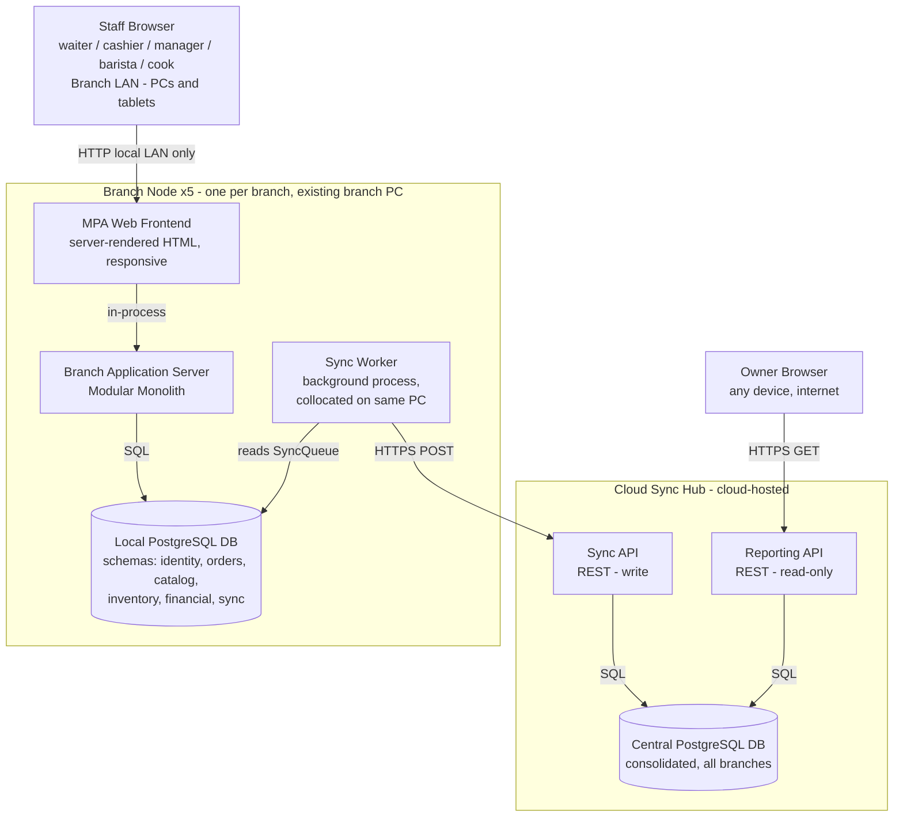
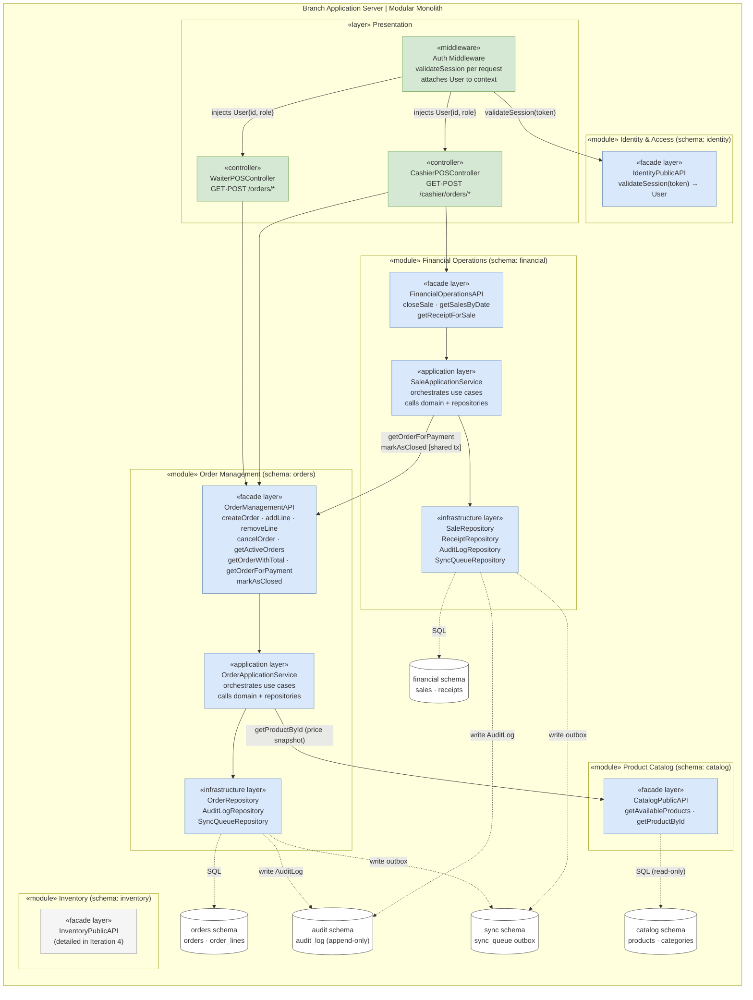
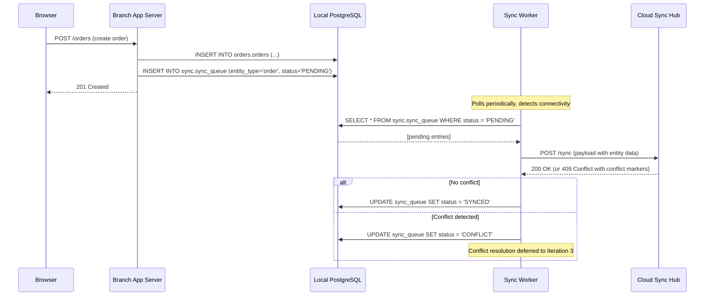
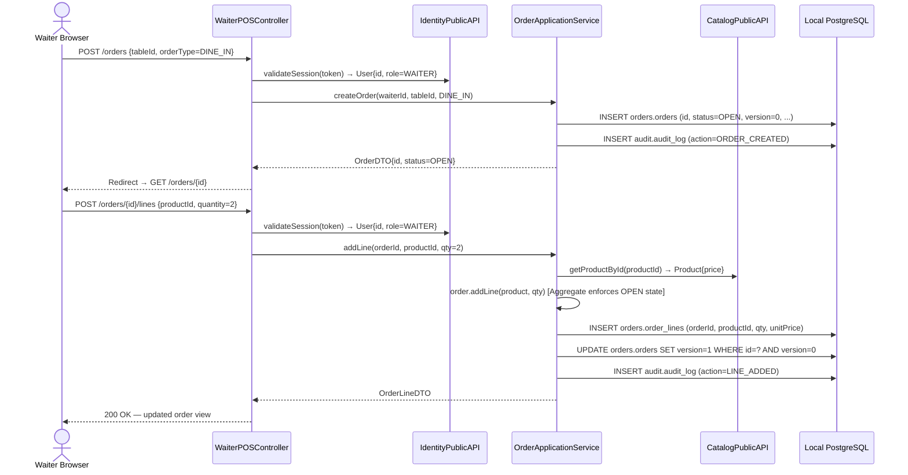
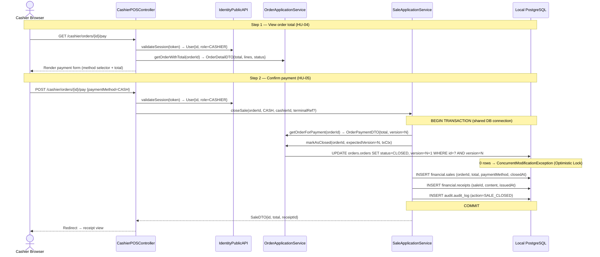

### 1.- Introduction
<!-- Create a description of the document -->
### 2.- Context diagram
<!-- Include the context diagram from the
[FILE:ArchitecturalDrivers.md] document, if available. Include a paragraph at the beginning that describes what this diagram shows.
-->
### 3.- Architectural drivers
<!-- Include a summary of the drivers described in
[FILE:ArchitecturalDrivers.md], including their priorities. You
should separate user stories, quality attribute scenarios, concerns
and constraints in separate tables. -->
### 4.- Domain model

This domain model captures the core business concepts of the **La Toscana** franchise management system.
It is derived from the functional requirements (HU-01 to HU-28), the quality attribute scenarios and the architectural constraints defined in `ArchitecturalDrivers.md`.
The model is organized around seven bounded contexts: **Identity & Access**, **Order Management**, **Product Catalog**, **Inventory**, **Financial Operations**, **Purchasing**, and **Reporting**.

```plantuml
@startuml LaToscana_DomainModel
skinparam classAttributeIconSize 0
skinparam groupInheritance 2
hide empty members

' ── Identity & Access ─────────────────────────────────────────────────
package "Identity & Access" {

    class User {
        +String id
        +String name
        +String email
        +String passwordHash
        +login()
        +logout()
    }

    enum Role {
        OWNER
        MANAGER
        CASHIER
        WAITER
        BARISTA
        COOK
    }

    class Permission {
        +String id
        +String resource
        +String action
    }

    User "1" --> "1" Role : has
    Role "1" --> "*" Permission : grants
}

' ── Franchise & Branch ────────────────────────────────────────────────
package "Franchise & Branch" {

    class Franchise {
        +String id
        +String name
    }

    class Sucursal {
        +String id
        +String name
        +String location
        +Boolean onlineStatus
    }

    Franchise "1" --> "1..*" Sucursal : operates
}

User "*" --> "1" Sucursal : belongs to

' ── Product Catalog ───────────────────────────────────────────────────
package "Product Catalog" {

    class Product {
        +String id
        +String name
        +String description
        +Decimal price
        +String photoUrl
        +Boolean available
    }

    class Category {
        +String id
        +String name
    }

    class Recipe {
        +String id
        +String preparation
    }

    class RecipeLine {
        +Decimal quantity
        +String unit
    }

    class Ingredient {
        +String id
        +String name
        +String unit
    }

    Product "*" --> "1"  Category   : belongs to
    Product "1" --> "0..1" Recipe   : defined by
    Recipe  "1" *-- "*" RecipeLine  : composed of
    RecipeLine "*" --> "1" Ingredient : uses
}

' ── Order Management ──────────────────────────────────────────────────
package "Order Management" {

    class Order {
        +String id
        +DateTime createdAt
        +Decimal total
    }

    enum OrderStatus {
        OPEN
        SENT_TO_KITCHEN
        READY
        CLOSED
        CANCELLED
    }

    enum OrderType {
        DINE_IN
        TAKEAWAY
    }

    class OrderLine {
        +int quantity
        +Decimal unitPrice
        +String notes
    }

    class Table {
        +String id
        +int number
    }

    enum TableStatus {
        AVAILABLE
        OCCUPIED
    }

    Order "1"  --> "1"   OrderStatus : has
    Order "1"  --> "1"   OrderType   : is of
    Order "1"  *-- "*"   OrderLine   : contains
    Order "*"  --> "0..1" Table      : assigned to
    Table "1"  --> "1"   TableStatus : has
    OrderLine "*" --> "1" Product    : references
}

Order "*" --> "1" Sucursal : belongs to

' ── Financial Operations ──────────────────────────────────────────────
package "Financial Operations" {

    class Sale {
        +String id
        +DateTime closedAt
        +Decimal total
    }

    enum PaymentMethod {
        CASH
        CARD
    }

    class Receipt {
        +String id
        +DateTime issuedAt
        +String content
    }

    class CashRegisterCut {
        +String id
        +Date date
        +Decimal expectedAmount
        +Decimal actualAmount
        +Decimal difference
    }

    class Promotion {
        +String id
        +String name
        +String description
        +Decimal discount
        +DateTime startDate
        +DateTime endDate
        +Boolean active
    }

    Sale "1"  --> "1"    Order         : closes
    Sale "1"  --> "1"    PaymentMethod : paid by
    Sale "1"  --> "1"    Receipt       : generates
    Sale "*"  --> "0..1" Promotion     : applies
    CashRegisterCut "*" --> "*" Sale   : consolidates
}

CashRegisterCut "*" --> "1" Sucursal : for

' ── Inventory ─────────────────────────────────────────────────────────
package "Inventory" {

    class InventoryItem {
        +String id
        +Decimal stock
        +Decimal minLevel
    }

    class StockAdjustment {
        +String id
        +DateTime date
        +Decimal quantity
        +String justification
    }

    enum AdjustmentReason {
        WASTE
        THEFT
        CORRECTION
        PURCHASE_RECEIPT
    }

    class StockAlert {
        +String id
        +DateTime triggeredAt
        +Boolean acknowledged
    }

    InventoryItem "*"  --> "1"  Ingredient      : tracks
    InventoryItem "1"  *-- "*"  StockAdjustment : records
    StockAdjustment "1" --> "1" AdjustmentReason : classified as
    InventoryItem "1"  --> "*"  StockAlert      : generates
}

InventoryItem "*" --> "1" Sucursal : kept at

' ── Purchasing ────────────────────────────────────────────────────────
package "Purchasing" {

    class Supplier {
        +String id
        +String name
        +String contactInfo
    }

    class SupplierProduct {
        +Decimal price
        +String unit
    }

    class PurchaseOrder {
        +String id
        +DateTime issuedAt
        +String status
    }

    class PurchaseOrderLine {
        +Decimal quantityOrdered
        +Decimal quantityReceived
        +Decimal unitCost
    }

    Supplier  "1"  --> "*"  SupplierProduct    : offers
    SupplierProduct "*" --> "1" Ingredient      : corresponds to
    PurchaseOrder "1" *-- "*" PurchaseOrderLine : contains
    PurchaseOrderLine "*" --> "1" SupplierProduct : references
    PurchaseOrder "*" --> "1" Supplier           : placed with
}

PurchaseOrder "*" --> "1" Sucursal : delivered to

' ── Customer & Loyalty ────────────────────────────────────────────────
package "Customer & Loyalty" {

    class Customer {
        +String id
        +String name
        +String contact
    }
}

Sale "*" --> "0..1" Customer : associated with

' ── Cross-cutting: Offline Sync ───────────────────────────────────────
package "Offline Sync" {

    class SyncQueue {
        +String id
        +String entityType
        +String entityId
        +String payload
        +DateTime queuedAt
    }

    enum SyncStatus {
        PENDING
        SYNCED
        CONFLICT
        FAILED
    }

    SyncQueue "1" --> "1" SyncStatus : has
    SyncQueue "*" --> "1" Sucursal   : queued at
}

' ── Cross-cutting: Audit Log ──────────────────────────────────────────
package "Audit" {

    class AuditLog {
        +String id
        +DateTime timestamp
        +String entityType
        +String entityId
        +String action
    }

    AuditLog "*" --> "1" User : performed by
}

@enduml
```

#### Domain model element descriptions

| Element | Type | Description |
|---|---|---|
| **User** | Entity | Represents a system user (employee). Holds credentials and is bound to exactly one `Role` and one `Sucursal`. Supports HU-28, QA-SEC-01/02/03, RES-06. |
| **Role** | Enumeration | The six operational roles defined in RES-06: OWNER, MANAGER, CASHIER, WAITER, BARISTA, COOK. |
| **Permission** | Value Object | Defines a granular access rule (resource + action) assigned to a `Role` via RBAC (C003.1.1, C003.1.2). |
| **Franchise** | Entity | The top-level organizational unit, owning all branches of La Toscana. Supports the multi-tenant data model (C007.1.1). |
| **Sucursal** | Entity | One of the five physical branches. Tracks its own `onlineStatus` to support offline operation (HU-27, RES-01). |
| **Product** | Entity | An item available for sale. Centralizes pricing, descriptions and photos for consistency across branches (HU-18, NEC-05). |
| **Category** | Entity | Groups products for filtering in the POS and the QR digital menu (HU-22, HU-23). |
| **Recipe** | Entity | The standardized preparation procedure linked to a `Product` (HU-08, HU-21, NEC-06). |
| **RecipeLine** | Value Object | One ingredient + quantity entry within a `Recipe`. Enables automatic inventory deduction per sale. |
| **Ingredient** | Entity | A raw material tracked in inventory. Shared between `Recipe` and `InventoryItem` (NEC-01, NEC-06). |
| **Order** | Entity | A customer order linked to a table or marked as take-away. Lifecycle goes from OPEN to CLOSED (HU-01, HU-02, HU-04, HU-06). Contains full traceability. |
| **OrderStatus** | Enumeration | State machine for an order: OPEN → SENT_TO_KITCHEN → READY → CLOSED / CANCELLED. Drives kitchen display and waiter notifications (HU-07, HU-09). |
| **OrderType** | Enumeration | DINE_IN for table service, TAKEAWAY for direct sales. Covers HU-06. |
| **OrderLine** | Value Object | A single product-quantity entry within an `Order`, capturing the price at the moment of sale. |
| **Table** | Entity | Represents a physical table at a branch. Maintains AVAILABLE / OCCUPIED status to support the cashier view (HU-04). |
| **TableStatus** | Enumeration | AVAILABLE or OCCUPIED, reflecting each table's current state. |
| **Sale** | Entity | Represents a closed, paid transaction tied to an `Order`. Records the payment method and links to a `Receipt` (HU-05, NEC-03). |
| **PaymentMethod** | Enumeration | CASH or CARD payment options available at the POS (HU-05). |
| **Receipt** | Entity | The purchase proof generated at the moment of payment (HU-05, C002.3.2). |
| **CashRegisterCut** | Entity | The daily financial closing for one branch: expected vs. actual cash, automated by the system (HU-10, HU-11, NEC-03). |
| **Promotion** | Entity | A timed discount applicable to sales. Managed centrally by the owner and reflected in the QR menu (HU-24, HU-25). |
| **InventoryItem** | Entity | Tracks the current stock of one `Ingredient` at one branch. Triggers low-stock alerts (HU-12, HU-13, NEC-01). |
| **StockAdjustment** | Entity | Records a manual change to inventory stock (waste, correction, receipt), with justification for audit purposes (HU-14, C003.3.1). |
| **AdjustmentReason** | Enumeration | Classifies inventory adjustments: WASTE, THEFT, CORRECTION, PURCHASE_RECEIPT. |
| **StockAlert** | Entity | Auto-generated notification when an `InventoryItem` drops to or below its minimum level (HU-13, QA-MOD-03). |
| **Supplier** | Entity | A provider of ingredients, including contact data and historical pricing (HU-19, NEC-02). |
| **SupplierProduct** | Value Object | Associates a `Supplier` with an `Ingredient` at a specific price and unit (HU-19, HU-20). |
| **PurchaseOrder** | Entity | A formal order sent to a `Supplier`. On reception, automatically updates `InventoryItem` stock (HU-20, NEC-02). |
| **PurchaseOrderLine** | Value Object | One line (ingredient, quantity ordered, quantity received, unit cost) within a `PurchaseOrder`. |
| **Customer** | Entity | Stores basic contact data for a guest to support future loyalty programs (HU-26, NEC-09). |
| **SyncQueue** | Entity | Queues entity mutations generated while a branch is offline, to be replayed upon reconnection (HU-27, RES-01, RES-07, C001.2.1). |
| **SyncStatus** | Enumeration | Lifecycle of a queued item: PENDING → SYNCED / CONFLICT / FAILED. |
| **AuditLog** | Entity | Immutable record of every sensitive action (who, what, when) for security traceability (QA-SEC-02, C003.3.1, C003.3.2). |

### 5.- Container diagram

This diagram shows the top-level containers that compose the La Toscana system as established in Iteration 1. There are five autonomous **Branch Nodes** (one per branch), each running on the existing branch PC, and one central **Cloud Sync Hub** hosted in the cloud. Each Branch Node is fully self-contained and operational without internet access. The Cloud Sync Hub aggregates data from all branches and exposes a reporting interface exclusively to the owner.

> **Actor separation:** Staff browsers (waiters, cashiers, managers, baristas, cooks) access **only** the Branch Node MPA via local LAN — no direct access to the Cloud Sync Hub. The owner browser accesses **only** the Reporting API on the Cloud Sync Hub over the internet. Customers/diners are out of scope for this iteration (QR menu is addressed in Iteration 6).

> **Sync Worker colocation:** The Sync Worker is a background OS-level process (daemon/service) running on the **same physical branch PC** as the Branch Application Server and PostgreSQL. It is not a separate machine. It has no HTTP interface; it only reads from the local DB and pushes to the Cloud Sync Hub.

#### Container responsibilities

| Container | Who accesses it | Responsibility |
|---|---|---|
| **MPA Web Frontend** | Staff browsers — local LAN only | Serves server-rendered HTML pages to staff browsers on branch PCs and tablets. Provides role-gated sections: POS View, Kitchen Display View, Manager View. Calls the Branch Application Server in-process. |
| **Branch Application Server** | MPA Web Frontend (in-process) | Hosts the modular monolith with all branch-local business logic (Identity & Access, Order Management, Product Catalog, Inventory, Financial Operations). Each module accessed only through its Public API/Facade. |
| **Local PostgreSQL DB** | Branch App Server (SQL); Sync Worker (reads sync schema) | Persists all branch-local data using one schema per bounded-context module plus a shared `sync` schema for the SyncQueue outbox. Provides ACID guarantees for financial data integrity. |
| **Sync Worker** | Local DB (reads); Cloud Sync Hub (writes) | Background process collocated on the branch PC. Reads `PENDING` entries from `sync.sync_queue` and pushes them to the Cloud Sync Hub when internet is available. Marks entries `SYNCED`, `CONFLICT`, or `FAILED`. |
| **Sync API** | Sync Workers from all 5 branches | REST write endpoint on the Cloud Sync Hub. Receives sync payloads, applies them to the Central DB, returns conflict markers. |
| **Reporting API** | Owner browser — internet only | Read-only REST endpoint on the Cloud Sync Hub. Serves consolidated multi-branch data (sales, inventory, financials) exclusively to the owner. |
| **Central PostgreSQL DB** | Sync API (writes); Reporting API (reads) | Consolidated database at hub level. Stores data synced from all five branches. Source of truth for cross-branch reporting. |

### 6.- Component diagrams

#### 6.1 — Branch Application Server

This diagram details the internal architecture of the Branch Application Server (a modular monolith). The **Presentation Layer** (Auth Middleware + POS Controllers) is the sole entry point. It delegates to the five bounded-context modules exclusively through each module's **«facade layer» (Public API)**. 

Inside each module, the **«application layer»** orchestrates use cases without touching the database directly. Only the **«infrastructure layer»** (Repositories) has access to the PostgreSQL databases. Cross-module database joins are forbidden.

#### Component responsibilities

| Component | Responsibility |
|---|---|
| **Auth Middleware** | Intercepts HTTP requests application-wide. Validates session token via `IdentityPublicAPI` and attaches the `User` to the request context. Prevents unauthenticated access before controllers execute. |
| **WaiterPOSController** | HTTP entry point for waiters (`GET /orders/new`, `POST /orders`, etc.). Validates waiter RBAC role on the context user. Delegates to `OrderManagementAPI` to create/edit orders and renders the response. |
| **CashierPOSController** | HTTP entry point for cashiers. Two-step payment form. Validates cashier RBAC role. Delegates order reads to `OrderManagementAPI` and sale execution to `FinancialOperationsAPI`. |
| **Identity & Access Module** | Manages users, roles, permissions and sessions. Authenticates requests and enforces RBAC. Caches the role/permission table locally to support offline authentication. |
| **Order Management Module** | Enforces the `Order` Aggregate Root state machine (OPEN-only edits). Records `AuditLog` on mutation. Snapshots catalog prices. Generates `SyncQueue` outbox records. Exposes internal `markAsClosed` operation for shared-transaction execution. |
| **Product Catalog Module** | Read-only in this iteration. Exposes operations to retrieve available products and lookup product details (prices). |
| **Financial Operations Module** | Executes `closeSale` inside a single PostgreSQL transaction (Unit of Work) spanning local Financial and Order updates. Records `paymentMethod` (CASH/CARD) locally without external gateway calls. Generates `SyncQueue` outbox records. |
| **Inventory Module** | Public API to be detailed in Iteration 4. Tracks ingredient stock levels per branch and generates low-stock alerts. |
| **sync.sync_queue (Outbox)** | Shared DB table written by module Infrastructure layers. Stores PENDING entity mutations to be picked up by the background Sync Worker. Guarantees zero data loss (offline-first). |
| **audit.audit_log** | Append-only DB table written by module Infrastructure layers. Immutable record of who performed which sensitive action and when. |

### 7.- Sequence diagrams

#### 7.1 — Offline Write and Synchronization Flow

This diagram illustrates the cross-cutting offline-first pattern: a branch operation (e.g., order creation) is written locally first and stored in the SyncQueue outbox. When the Sync Worker detects internet connectivity, it pushes pending entries to the Cloud Sync Hub. This flow satisfies **C001.2.1** (offline-online sync strategy), **QA-REL-01** (0% data loss after offline period), and **QA-REL-03** (consistent global state after multi-branch reconnection).

#### 7.2 — Waiter Registers an Order (HU-01, HU-06)

This diagram illustrates how a waiter creates a new order and adds product lines, showing the interaction between the Presentation Layer, Identity, Order Management, and the Product Catalog.

#### 7.3 — Cashier Views Order and Closes Sale (HU-04, HU-05)

This diagram outlines the two-step cashier flow: reviewing the auto-calculated total, then executing the payment within a single cross-schema database transaction.

### 8.- Interfaces
<!-- This section will include details about contracts- -->

### 9.- Design decisions

The following design decisions were made to address the selected drivers across iterations.

#### Iteration 1 Decisions (Baseline Architecture)
| Driver | Decision | Rationale | Discarded Alternatives |
|---|---|---|---|
| RES-01, RES-09, QA-AVA-02, C004.3.1 | Deploy one self-contained **Branch Node** per branch running on the existing branch PC | Branches must operate fully offline. A local node eliminates internet dependency for day-to-day operations and runs on existing hardware without additional investment. | Pure Cloud SaaS *(inoperable without internet)*; Thin client to central server *(single point of failure)* |
| RES-01, QA-REL-01, QA-REL-03, C001.2.1 | **Offline-First + Outbox Pattern (SyncQueue)** — writes go to the local DB first; a Sync Worker replays them to the hub when connectivity is restored | Guarantees zero data loss during offline periods. Idempotent replay prevents duplicates on reconnection. Decouples write performance from network availability. | Fire-and-forget HTTP sync *(loses data on timeout)*; Polling without queue *(misses events during offline windows)* |
| RES-06, QA-SEC-01/02/03, C003.1.1, C003.1.4 | **RBAC with locally cached permission table** in the Auth Module | Six operational roles must be enforced even when the branch has no internet. A locally cached role/permission table enables offline authentication without contacting the Cloud Hub. | ABAC *(over-complex for team size)*; Online-only RBAC *(fails offline)* |
| RES-03, RES-09 | **Server-rendered Multi-Page Application (MPA)** instead of SPA | The Branch Application Server is always reachable on the local LAN. An MPA requires no client-side build toolchain, making it significantly simpler for MVP. | SPA *(unnecessary complexity)*; Native apps *(multiply maintenance cost)* |
| C001.2.2, C005.1.1 | **One PostgreSQL schema per bounded-context module** (`identity`, `orders`, `catalog`, `inventory`, `financial`, `sync`) within the single branch Local DB | Enforces data isolation at the DB level within a single DB instance. Modules cannot join across schemas; they must communicate through Application-layer Public APIs. | Separate DB instance per module *(operational overhead)*; Shared schema with prefixed tables *(no enforced isolation)* |
| C002.1.1, C005.1.1, QA-MOD-01 | Each module exposes a **«facade layer» / Public API** as its only external entry point; internal layers are private | Makes module boundaries explicit and enforceable. Prevents coupling between modules through internal classes or DB queries. | Direct cross-module calls into Application/Domain layers *(creates tight coupling)* |
| C007.1.1, C007.1.2 | **Cloud Sync Hub** with separate Sync API (write) and Reporting API (read) backed by a Central PostgreSQL DB | Separates sync traffic from reporting traffic. The hub is the authority node for cross-branch data aggregation. | Branch-to-branch sync *(no authority node, conflict resolution intractable)* |

#### Iteration 2 Decisions (Order & Financial Flows)
| Driver | Decision | Rationale | Discarded Alternatives |
|---|---|---|---|
| HU-01, HU-04, HU-06, C002.1.3 | `OrderApplicationService` exposes named commands and queries as the sole Public API of Order Management | Named use-case methods enforce a single responsibility per operation. The dependency chain HU-01 → HU-04 → HU-05 is made explicit through `createOrder` → `getOrderWithTotal` → `closeSale`. | Mixed controller-business logic; transaction-script with no service boundary |
| HU-01, QA-SEC-02, C003.3.1 | `Order` class acts as Aggregate Root — enforces OPEN-only edits, owns the state machine | Invariants checked in one place without duplicating guards across callers. Closed orders are structurally unmodifiable. | Anemic model with checks in every controller; no explicit state machine |
| QA-REL-02 | `version INTEGER` column on `orders.orders` + `WHERE version = ?` guard in `OrderRepository.save` | Low-cost inclusion now avoids a cross-branch migration later. Satisfies QA-REL-02 with no DB-level lock held during user interaction. | Pessimistic locking (kills concurrency); no locking (deferred migration risk) |
| HU-05, C002.3.1 | `closeSale` records `paymentMethod` + optional `terminalRef` locally; no external API call | Physical bank terminal handles card authorization independently. Branch remains fully offline-capable (RES-01). | External payment gateway API (requires internet); Stripe Terminal SDK (incompatible with offline-first) |
| C002.1.2 | `closeSale` spans `orders` and `financial` schemas in a single PostgreSQL transaction | Atomicity within the single-process modular monolith guarantees either both the order close and the sale record commit, or neither does. | Saga with compensating transactions (overkill); eventual consistency via Outbox (appropriate for cloud sync, not for immediate local POS close) |
| QA-SEC-02, C003.3.1 | `AuditLog` written by Infrastructure layer inside every Application Service command within the same transaction | Audit entries are inseparable from the operation that produced them — both commit or both roll back. No audit entry can be lost or forged. | Audit in Presentation Layer (misses non-browser calls); separate audit service (breaks atomicity) |
| QA-USA-03 | Two-step cashier payment flow: `GET /pay` renders the method selector; `POST /pay` confirms | Cashier can review and change the method before finalizing — correction in ≤ 2 steps with no data loss. | Single-step POST (no chance to correct); client-side modal (adds JS complexity to an MPA) |
| C002.1.3 | `OrderApplicationService.addLine` calls `CatalogPublicAPI.getProductById` to snapshot `unitPrice` into `OrderLine` | Price at order time is preserved even if the catalog is updated later. Prevents price drift on active orders. | Reading price at payment time (price drift risk); storing only productId (requires join at query time, cross-schema violation) |

