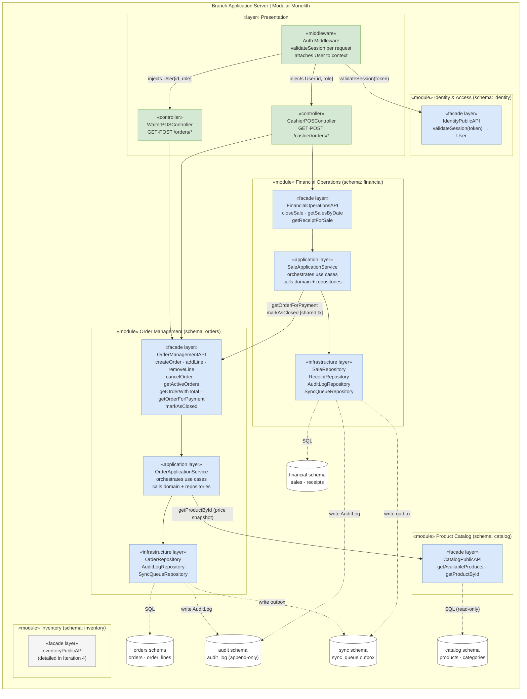
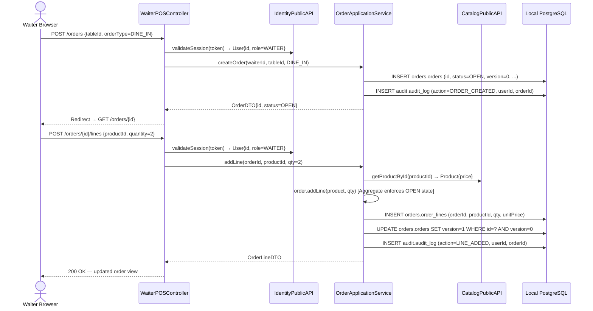
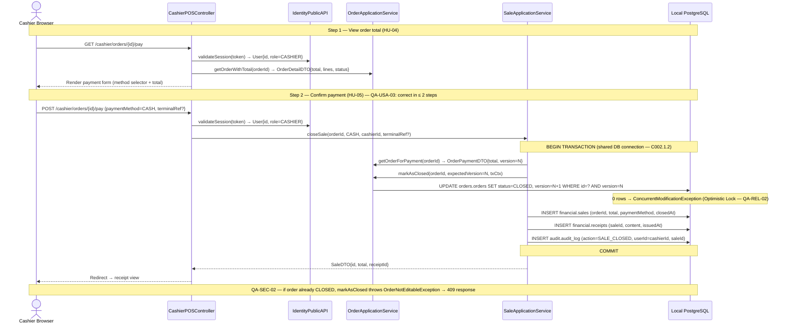

# Iteration 2 — Core Point-of-Sale Flow: Orders and Payments

---

## Step 2 — Iteration Goal and Selected Drivers

### Goal

> **Support the core point-of-sale flow (orders and payments).** Design the internal structure of the Order Management and Financial Operations modules so that waiters can register orders with full traceability and cashiers can calculate totals and close sales. This directly eliminates the unregistered/modified orders and manual calculation errors that generate the highest share of the $33,000–$58,000 MXN/month monthly losses.

### Drivers selected for this iteration

#### User Stories

| ID | Actor | Summary | Priority |
|---|---|---|---|
| **HU-01** | Mesero | Register orders from a tablet selecting products from the digital catalog, with full traceability. | 🔴 Alta |
| **HU-04** | Cajero | Consult active orders per table with auto-calculated totals. | 🔴 Alta |
| **HU-05** | Cajero | Register payment method (CASH or CARD) and generate a receipt. Card payments record the terminal result only — no external API call. | 🔴 Alta |
| **HU-06** | Cajero | Register direct/counter sales in the system so they are not excluded from the financial record. | 🔴 Alta |

> **Deferred to Iteration 5:** HU-02 (order auto-sent to kitchen/bar screen) requires the real-time kitchen notification channel, which is designed alongside the kitchen display view (HU-07) in Iteration 5.

#### Quality Attribute Scenarios

| ID | Attribute | Scenario |
|---|---|---|
| **QA-PERF-02** | Performance | Manager requests daily cash-register cut → system calculates and presents summary in ≤ 5 seconds. *(Partially addressed: data model established in this iteration; aggregation query deferred to Iteration 4.)* |
| **QA-USA-01** | Usability | A new waiter, with no prior training, registers their first order correctly in ≤ 3 minutes without help. |
| **QA-USA-03** | Usability | A cashier selects the wrong payment method and can correct it before closing the transaction in ≤ 2 steps, without losing order data. |
| **QA-SEC-02** | Security | A cashier attempts to modify an already-closed order → system blocks it, requires manager authorization, and leaves full traceability. |
| **QA-REL-02** | Reliability | Two cashiers process concurrent transactions → system maintains referential integrity and data consistency. |

> **Deferred:** QA-PERF-01 (order → kitchen/bar ≤ 2s) is deferred with HU-02 to Iteration 5.

#### Architectural Concerns

| ID | Concern |
|---|---|
| **C002.1.2** | Cross-module atomicity — guarantee consistency between order state update (Order Management) and sale creation (Financial Operations) within a single transaction. |
| **C002.1.3** | User story dependency chain — HU-04 depends on HU-01 producing order records; HU-05 depends on HU-04 resolving the order total. Module API contracts must reflect this ordering. |
| **C002.3.1** | Payment integration — scoped to recording the terminal result only (CASH/CARD + amount); no external payment gateway API call in the branch. |
| **C003.3.1** | Full traceability — record who performed each action and when for all order and financial operations. |

---

## Step 3 — Elements of the System to Refine

Refinement approach: **top-down decomposition within the Branch Application Server**, focusing on the two modules whose internal design is required to support the Iteration 2 drivers. The Branch Node containers established in Iteration 1 are not changed.

| # | Element to Refine | Refinement Type | Rationale |
|---|---|---|---|
| **1** | **Order Management Module** (inside Branch Application Server) | Internal decomposition — define Public API operations, Application Services, and enforcement of the Order state machine | Needed for HU-01, HU-04, HU-06. Without specifying what `OrderManagement.PublicAPI` exposes, no POS sequence diagram can be drawn and the downstream Financial Operations dependency (C002.1.3) has no contract to rely on. |
| **2** | **Financial Operations Module** (inside Branch Application Server) | Internal decomposition — define Public API operations and Application Services for sale closing and receipt generation | Needed for HU-05, HU-06. Depends on Order Management Public API (`getOrderForPayment`, `markAsClosed`) to retrieve the total and close the order atomically (C002.1.2). |
| **3** | **Presentation Layer** — POS routes only | Partial extension — add the HTTP routes and controller responsibilities for the waiter order-entry view and the cashier payment view | The Presentation Layer is the browser entry point for all staff. The two new POS views must be allocated to specific controller responsibilities and wired to module Public APIs. |
| **4** | **Product Catalog Module** — read interface only | Minimal extension — confirm the `getAvailableProducts` / `getProductById` operations of the Public API | Order Management calls Product Catalog during order creation (established in Iteration 1). The contract must be defined to draw the HU-01 sequence diagram. Only the read side is touched; no write operations are added. |

> **Out of scope:** Cloud Sync Hub internals, Sync Worker behavior, Identity & Access internals, and Inventory module internals — addressed in Iterations 3 and 4 respectively.

---

## Step 4 — Design Concepts That Satisfy the Selected Drivers

| Design Concept | Type | Pros | Cons | Discarded Alternatives |
|---|---|---|---|---|
| **Order Aggregate Root** | Design Pattern | `Order` encapsulates its `OrderLine` entries and enforces the status state machine (OPEN → CLOSED / CANCELLED). Invariants — e.g., lines cannot be added to a CLOSED order — are enforced in one place. Directly supports HU-01, HU-04, QA-SEC-02, C003.3.1. | Module boundary must be respected — external modules access `Order` only via Public API; they cannot manipulate `OrderLine` directly. | Anemic domain model *(invariants leak into Application layer, duplicated across callers)*; No aggregate *(any service modifies orders freely, breaking QA-SEC-02)* |
| **Application Service Layer** | Architectural Pattern | Each module's Public API exposes named use-case methods — commands that mutate state (`createOrder`, `addLine`, `closeSale`) and queries that read state (`getActiveOrders`, `getOrderTotal`). Clean, predictable entry points. Satisfies QA-USA-01, QA-PERF-02 foundation. | Each method must have a single, clear responsibility; discipline required to avoid mixing state changes with reads. | Mixed controller-service logic *(couples HTTP layer to business logic)*; Full CQRS with separate read model *(over-engineered for this scale and team size)* |
| **Local DB Transaction Boundary** | Tactic (C002.1.2) | In the single-process modular monolith, `closeSale` wraps the Order status update (`orders` schema) and the Sale record creation (`financial` schema) in one PostgreSQL transaction. Atomicity guaranteed without distributed transactions or sagas. | Transaction context must be passed explicitly through the call chain. Requires agreed protocol between modules at the application layer. | Saga / compensating transactions *(overkill for a single-process monolith)*; Eventual consistency via Outbox *(appropriate for cloud sync, but not for a local POS close that must be immediately consistent)* |
| **Optimistic Locking on `Order`** | Tactic (QA-REL-02) | A `version` integer column on `orders.orders` is incremented on every write. Any concurrent `UPDATE` with a stale version matches 0 rows, and the application raises a conflict error. Prevents silent data corruption with negligible schema cost (one column). While branches currently operate with one cashier PC (RES-09), the cost of adding this later is a coordinated migration across all 5 branch nodes, making it cheaper to include now. | Requires conflict error handling in the Presentation Layer (a user-facing message). Adds one extra column to the table. | Pessimistic locking *(holds a DB lock for the duration of the POS interaction — kills concurrency under peak load)*; No locking *(last-write-wins silently — deferred migration risk outweighs the low probability of the current scenario)* |
| **Append-only Audit Log** | Tactic (QA-SEC-02, C003.3.1) | Every state-changing command on `Order` and `Sale` writes an immutable `AuditLog` entry `(userId, action, entityId, timestamp)` inside the Application Service. The `AuditLog` entity already exists in the domain model — this tactic formalizes *when and where* it is written. | Adds one extra write per command. Log retention policy deferred to Iteration 4. | File-only logging *(not queryable, lost on disk failure)*; Audit inside the Presentation Layer *(misses API calls not originating from the browser)* |
| **Payment as local record** | Tactic (C002.3.1) | Card payment is processed by the physical bank terminal (datáfono) as an independent device. The branch application records only the result (method: CARD/CASH, amount, optional terminal reference) entered by the cashier after terminal approval. No HTTP call to an external gateway — works fully offline (RES-01). Satisfies HU-05. | System cannot verify card authorization programmatically. Terminal reference entered manually. Future terminal USB/serial integration deferred. | External payment gateway API *(requires internet — breaks RES-01 and QA-AVA-02)*; Stripe Terminal SDK *(adds external dependency, incompatible with offline-first pattern)* |

---

## Step 5 — Instantiate Architectural Elements

The following decisions adapt the design concepts from Step 4 to the specific drivers of this iteration. Each decision produces a new or extended element inside the Branch Application Server.

| Instantiation Decision | Rationale |
|---|---|
| **Order Management Module** exposes an `OrderApplicationService` with these Public API operations — commands: `createOrder(waiterId, tableId?, orderType)`, `addLine(orderId, productId, quantity, notes?)`, `removeLine(orderId, lineId, managerId)`, `cancelOrder(orderId, managerId)` — queries: `getActiveOrders(branchId)`, `getOrderWithTotal(orderId)`, `getOrderForPayment(orderId)`. Internal cross-module-only methods: `markAsClosed(orderId, txContext)`. | Instantiates the **Application Service Layer** pattern for Order Management. Named methods map one-to-one to the user stories (HU-01 → `createOrder`/`addLine`; HU-04 → `getActiveOrders`/`getOrderWithTotal`; HU-06 → `createOrder` with `orderType = COUNTER`). The `getOrderForPayment` + `markAsClosed` pair is the contract required by C002.1.3. |
| **`Order` class** acts as Aggregate Root: it owns its `OrderLine` collection and enforces the state machine (`OPEN` → `CANCELLED`; `OPEN` → `CLOSED` only via Financial Operations). Any attempt to add or remove lines on a non-`OPEN` order raises an `OrderNotEditableException`. | Instantiates the **Order Aggregate Root** pattern. Enforces the invariant that directly satisfies QA-SEC-02 without relying on the caller to check order status. The Presentation Layer never bypasses the aggregate. |
| **`orders.orders` table** gains a `version INTEGER NOT NULL DEFAULT 0` column. `OrderRepository.save(order)` issues `UPDATE orders.orders SET ..., version = version + 1 WHERE id = ? AND version = ?`. If 0 rows are updated, the service throws `ConcurrentModificationException`, and the Presentation Layer renders a conflict-resolution message to the user. | Instantiates **Optimistic Locking** on `Order`. One column addition; no lock held between reads and writes. Satisfies QA-REL-02 with negligible overhead. Avoids a costly cross-branch migration if added in a later iteration. |
| **Financial Operations Module** exposes a `SaleApplicationService` with Public API operations — command: `closeSale(orderId, paymentMethod, cashierId, terminalRef?)` — queries: `getSalesByDate(branchId, date)`, `getReceiptForSale(saleId)`. | Instantiates the **Application Service Layer** for Financial Operations. `closeSale` maps directly to HU-05. `getSalesByDate` provides the data foundation for QA-PERF-02 (cash-register cut aggregation query, detailed in Iteration 4). `getReceiptForSale` supports receipt retrieval. |
| **`closeSale` is executed within a single PostgreSQL transaction** (Unit of Work): ① `OrderApplicationService.getOrderForPayment(orderId)` reads order data, ② `OrderApplicationService.markAsClosed(orderId, txContext)` transitions order to `CLOSED` in `orders` schema, ③ `SaleRepository.save(sale)` writes the `Sale` record to `financial` schema, ④ receipt is generated in `financial` schema. All four steps commit or roll back together. | Instantiates the **Local DB Transaction Boundary** tactic (C002.1.2). Both schema writes share one DB connection, guaranteeing atomicity without a distributed transaction or saga. The `txContext` (database connection/session) is passed from Financial Operations into the Order Management internal `markAsClosed` method — the only cross-module call that shares a transaction context. |
| **Audit log writes** are inserted inside every Application Service command method for `Order` and `Sale`: `createOrder`, `addLine`, `removeLine`, `cancelOrder`, `closeSale`. Each write produces an immutable `AuditLog` row: `(id, userId, action, entityType, entityId, timestamp)` in a shared `audit` schema (or as a table in `orders` / `financial` schema pending decision in Iteration 3). | Instantiates the **Append-only Audit Log** tactic (QA-SEC-02, C003.3.1). The `AuditLog` entity already exists in the domain model; this decision fixes *when* and *where* it is written: inside Application Service commands, inside the same transaction as the main operation. |
| **`closeSale`** records `paymentMethod` (CASH or CARD) and an optional `terminalRef` string. No HTTP call is made to an external payment gateway. The physical bank terminal processes the card transaction independently; the cashier enters the result. | Instantiates the **Payment as local record** tactic (C002.3.1, HU-05). Keeps the Financial Operations module fully offline-capable (RES-01). Terminal reference stored for traceability (C003.3.1). |
| **Presentation Layer** gains two new controller groups: **WaiterPOSController** — routes `GET /orders/new`, `POST /orders`, `POST /orders/{id}/lines`, `DELETE /orders/{id}/lines/{lineId}`, `GET /orders/{id}`; **CashierPOSController** — routes `GET /cashier/orders`, `GET /cashier/orders/{id}/pay`, `POST /cashier/orders/{id}/pay`. Both controllers enforce session/role checks via Identity & Access Public API before delegating. | Allocates the POS HTTP surface to the Presentation Layer. WaiterPOSController supports HU-01 and HU-04 (active orders view). CashierPOSController supports HU-04 (total view), HU-05 (payment), HU-06 (counter sale via `orderType = COUNTER`). QA-USA-03 is addressed by the two-step payment flow: `GET /pay` (select method) → `POST /pay` (confirm). |
| **Product Catalog Module** Public API is confirmed to expose: `getAvailableProducts(branchId) → List<ProductDTO>` and `getProductById(productId) → ProductDTO`. These are read-only operations; no write operations are added in this iteration. | Required by C002.1.3 to allow `OrderApplicationService.addLine` to call `CatalogPublicAPI.getProductById` and capture the product price at the moment of sale into `OrderLine.unitPrice`. Prevents price drift if the catalog is updated after an order is placed. |

---

## Step 6 — Views, Responsibilities, Interfaces and Design Decisions

### Component Diagram — Branch Application Server (updated, C4 Level 3)

This diagram refines the Iteration 1 component diagram by showing the internal layers of each module (`«facade»`, `«application»`, `«infrastructure»`), adding `Auth Middleware` and proper presentation controllers, and strictly routing cross-module communication through Public APIs (Facades) and DB writes through Infrastructure layers.



#### Component responsibilities (Iteration 2 additions)

| Component | Responsibility |
|---|---|
| **WaiterPOSController** | Handles `GET /orders/new`, `POST /orders`, `POST /orders/{id}/lines`, `DELETE /orders/{id}/lines/{lineId}`, `GET /orders/{id}`. Validates waiter session via Identity Public API. Delegates to `OrderApplicationService`. Renders order views. |
| **CashierPOSController** | Handles `GET /cashier/orders`, `GET /cashier/orders/{id}/pay`, `POST /cashier/orders/{id}/pay`. Validates cashier session. Delegates order reads to `OrderApplicationService` and sale creation to `SaleApplicationService`. Two-step payment form (GET = select method, POST = confirm) satisfies QA-USA-03. |
| **OrderApplicationService** | Enforces Order Aggregate invariants (OPEN-only edits). Executes `createOrder`, `addLine`, `removeLine`, `cancelOrder`; writes `AuditLog` on each command. Snaps product price via CatalogPublicAPI. Exposes `getOrderForPayment` and `markAsClosed` (shared-tx) to Financial Operations. |
| **SaleApplicationService** | Executes `closeSale` within a single PostgreSQL transaction: calls `getOrderForPayment` + `markAsClosed` on OrderApplicationService, then writes `Sale` and `Receipt` to the financial schema. Records `AuditLog` entry. Exposes `getSalesByDate` (foundation for cash-register cut in Iteration 4). |
| **CatalogPublicAPI** | Read-only in this iteration: `getAvailableProducts(branchId)` and `getProductById(productId)`. Called by `OrderApplicationService.addLine` to snapshot the unit price into `OrderLine.unitPrice`. |
| **audit schema / AuditLog** | Append-only table written inside every Application Service command. Stores `(id, userId, action, entityType, entityId, timestamp)`. Never updated or deleted. |

---

### Sequence Diagram — HU-01: Waiter Registers an Order

This diagram illustrates how a waiter creates a new order and adds product lines. It satisfies **HU-01**, **HU-06** (via `orderType = COUNTER`), **QA-USA-01**, and **C003.3.1**.



> **HU-06 (counter/direct sale):** Identical flow with `orderType = COUNTER` and no `tableId`. No separate diagram needed.

---

### Sequence Diagram — HU-04 + HU-05: Cashier Views Order and Closes Sale

This diagram shows the two-step cashier flow: first viewing the order with the auto-calculated total (HU-04), then recording the payment and generating the receipt (HU-05). It satisfies **QA-USA-03** (two-step form), **QA-SEC-02** (closed order locked), **C002.1.2** (atomic cross-module close), and **C003.3.1** (full traceability).



---

### Design Decisions

| Driver | Decision | Rationale | Discarded Alternatives |
|---|---|---|---|
| HU-01, HU-04, HU-06, C002.1.3 | `OrderApplicationService` exposes named commands and queries as the sole Public API of Order Management | Named use-case methods enforce a single responsibility per operation. The dependency chain HU-01 → HU-04 → HU-05 is made explicit through `createOrder` → `getOrderWithTotal` → `closeSale`. | Mixed controller-business logic; transaction-script with no service boundary |
| HU-01, QA-SEC-02, C003.3.1 | `Order` class acts as Aggregate Root — enforces OPEN-only edits, owns the state machine | Invariants checked in one place without duplicating guards across callers. Closed orders are structurally unmodifiable. | Anemic model with checks in every controller; no explicit state machine |
| QA-REL-02 | `version INTEGER` column on `orders.orders` + `WHERE version = ?` guard in `OrderRepository.save` | Low-cost inclusion now avoids a cross-branch migration later. Satisfies QA-REL-02 with no DB-level lock held during user interaction. | Pessimistic locking (kills concurrency); no locking (deferred migration risk) |
| HU-05, C002.3.1 | `closeSale` records `paymentMethod` + optional `terminalRef` locally; no external API call | Physical bank terminal handles card authorization independently. Branch remains fully offline-capable (RES-01). | External payment gateway API (requires internet); Stripe Terminal SDK (incompatible with offline-first) |
| C002.1.2 | `closeSale` spans `orders` and `financial` schemas in a single PostgreSQL transaction | Atomicity within the single-process modular monolith guarantees either both the order close and the sale record commit, or neither does. | Saga with compensating transactions (overkill); eventual consistency via Outbox (appropriate for cloud sync, not for immediate local POS close) |
| QA-SEC-02, C003.3.1 | `AuditLog` written inside every Application Service command within the same transaction | Audit entries are inseparable from the operation that produced them — both commit or both roll back. No audit entry can be lost or forged. | Audit in Presentation Layer (misses non-browser calls); separate audit service (breaks atomicity) |
| QA-USA-03 | Two-step cashier payment flow: `GET /pay` renders the method selector; `POST /pay` confirms | Cashier can review and change the method before finalizing — correction in ≤ 2 steps with no data loss. | Single-step POST (no chance to correct); client-side modal (adds JS complexity to an MPA) |
| C002.1.3 | `OrderApplicationService.addLine` calls `CatalogPublicAPI.getProductById` to snapshot `unitPrice` into `OrderLine` | Price at order time is preserved even if the catalog is updated later. Prevents price drift on active orders. | Reading price at payment time (price drift risk); storing only productId (requires join at query time, cross-schema violation) |

---

## Step 7 — Analysis of Current Design

| Driver | Status | Rationale for Status |
|---|---|---|
| **HU-01** (Register orders) | Satisfied | Addressed by `WaiterPOSController` delegating to `OrderApplicationService.createOrder` and `addLine`. Order Aggregate enforces valid state. |
| **HU-04** (Consult active orders) | Satisfied | Addressed by `CashierPOSController` calling `OrderApplicationService.getOrderWithTotal`. Cashier views auto-calculated totals securely. |
| **HU-05** (Register payment) | Satisfied | Addressed by `CashierPOSController` + `SaleApplicationService.closeSale`. Two-step UI flow correctly captures local payment outcome. |
| **HU-06** (Counter sales) | Satisfied | Handled directly by HU-01 + HU-05 flows using `orderType = COUNTER` without requiring table assignment. |
| **QA-PERF-02** (Cash-cut ≤ 5s) | Partially Satisfied | The foundation is laid: `Sale` records are saved transactionally with an indexed `closedAt` date. Actual aggregation query design is deferred to Iteration 4. |
| **QA-USA-01** (Waiter registers ≤ 3m) | Satisfied | Waiter POS routes explicitly map to clear Application Service commands. Workflow is linear (create → add line → add line). |
| **QA-USA-03** (Cashier payment correct) | Satisfied | Addressed by the two-step controller flow (`GET /pay` to select/review → `POST /pay` to commit). Cashier can fix mistakes before the DB transaction starts. |
| **QA-SEC-02** (Closed order blocked) | Satisfied | Addressed structurally by the `Order` Aggregate Root and `OrderNotEditableException`. No controller can bypass the state machine. |
| **QA-REL-02** (Concurrent cashiers) | Satisfied | Addressed by Optimistic Locking (`version` column) on `Order`. Prevents lost updates with negligible schema overhead. |
| **C002.1.2** (Cross-module atomicity) | Satisfied | Addressed by the Local DB Transaction Boundary pattern around `closeSale`, sharing the DB context with `markAsClosed`. |
| **C002.1.3** (UI dependency chain) | Satisfied | Addressed by splitting `OrderManagementAPI` reads from `FinancialOperationsAPI` writes in the cashier flow, and snapshotting catalog prices. |
| **C002.3.1** (Payment integration scoped) | Satisfied | Card payments are recorded strictly as manual terminal result inputs. No external HTTP calls compromise offline capabilities. |
| **C003.3.1** (Full traceability) | Satisfied | Addressed by appending to `AuditLog` inside every Application Service command, bound to the same database transaction as the primary write. |

---

> **End of Iteration 2.** The core POS local execution flow is now structurally sound. Iteration 3 will address Identity & Access, and conflict resolution for the Cloud Sync Hub..
```
