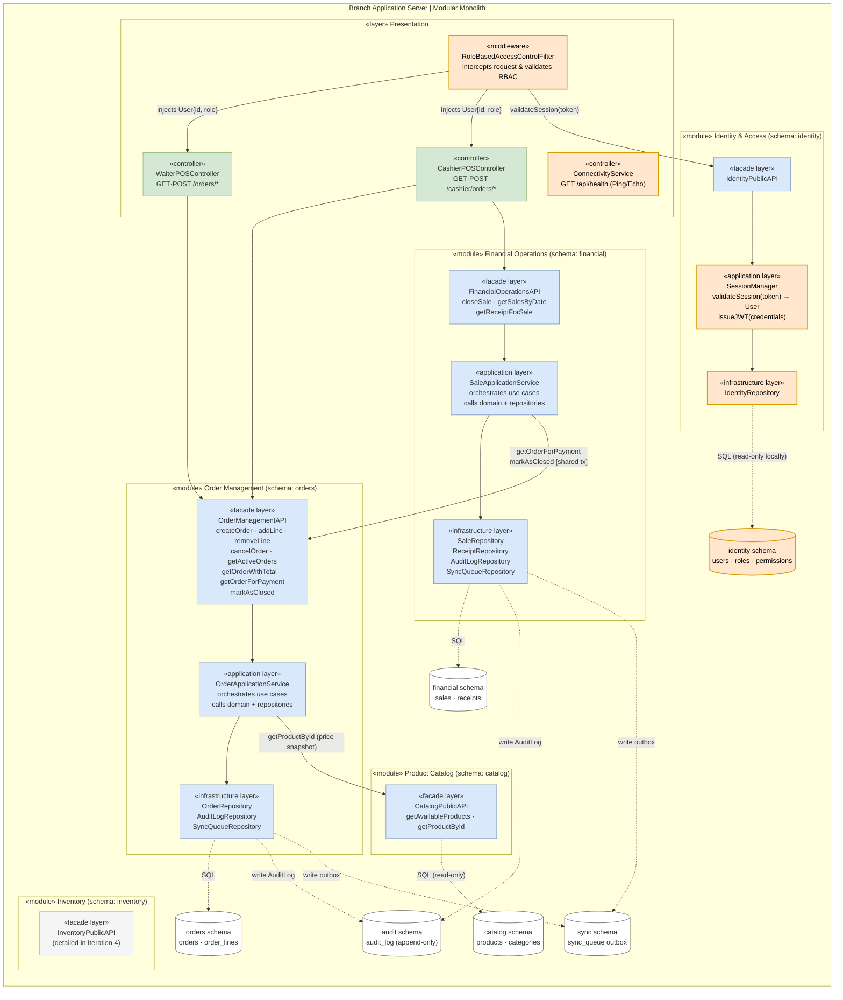
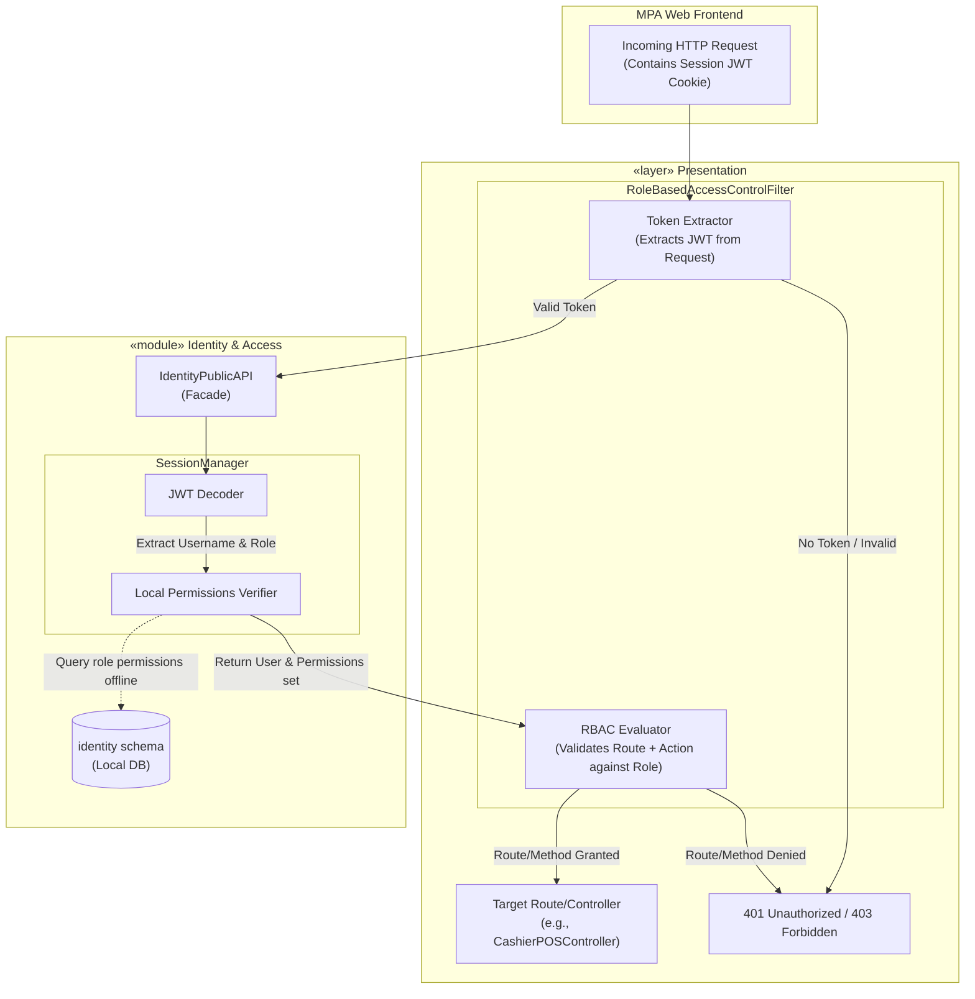
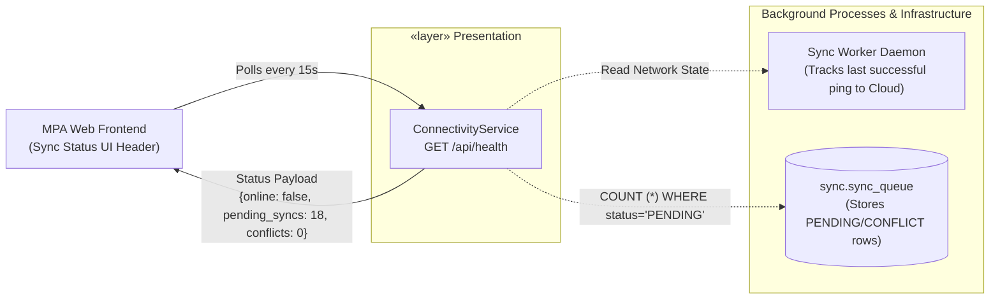
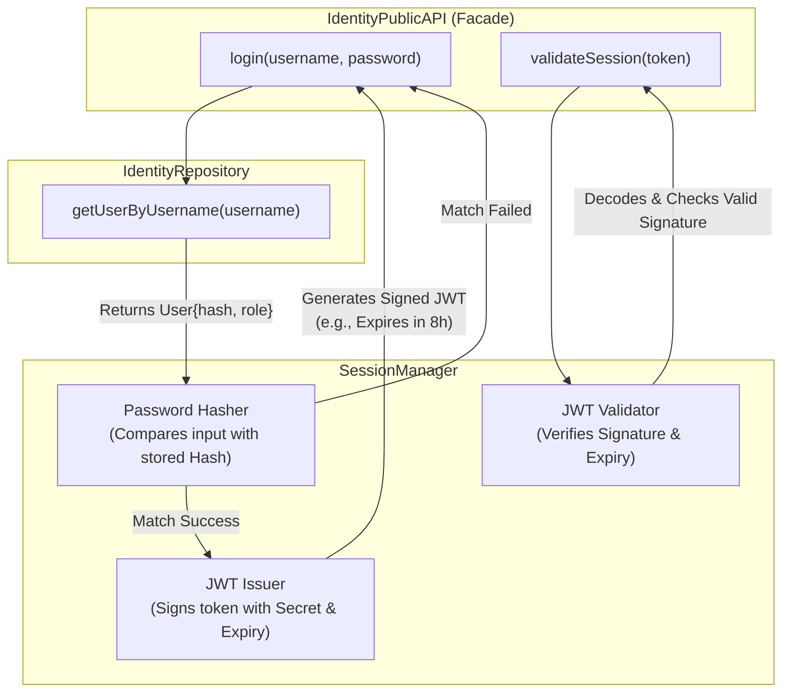
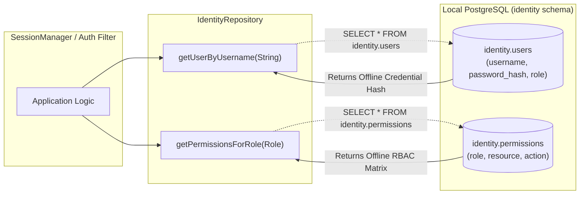
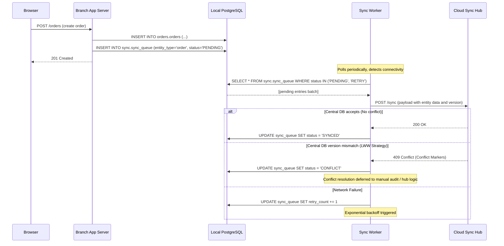
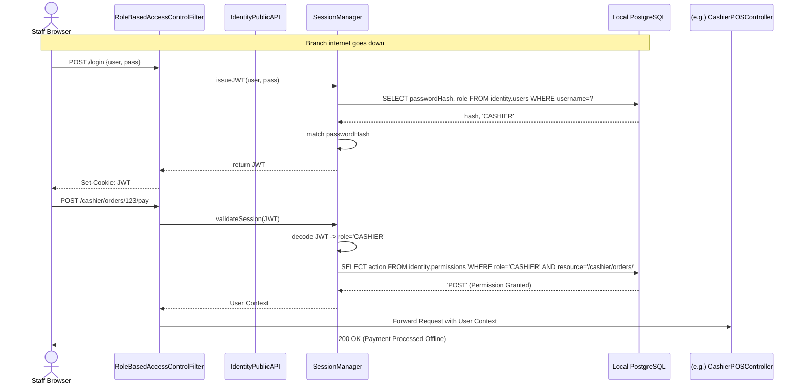

# Iteration 3

## Step 2: Establish goal for the iteration by selecting drivers

Based on the `IterationPlan.md` and `ArchitecturalDrivers.md` documents, here is the goal and the associated drivers for **Iteration 3**:

**Goal:**
**Implement role-based security and offline operation.** Harden the authentication and authorization subsystem (RBAC for all six roles) and make the system fully functional when internet connectivity is unavailable. These are mandatory pre-conditions for production rollout in the three branches with intermittent connectivity.

**Selected Drivers:**

*   **User Stories (HU):**
    *   **HU-27 (🔴 Alta):** Modo offline y sincronización automática.
    *   **HU-28 (🔴 Alta):** Roles y permisos diferenciados (RBAC).

*   **Quality Attributes (QA):**
    *   **QA-SEC-01, QA-SEC-02, QA-SEC-03:** Bloqueo de acceso por rol, protección de órdenes, caducidad de sesión.
    *   **QA-AVA-02:** Recuperación ante fallo del servidor (offline handling).
    *   **QA-REL-01, QA-REL-02, QA-REL-03:** Sincronización offline sin pérdidas, integridad concurrente, consistencia multi-sucursal.

*   **Constraints:**
    *   **RES-01:** El sistema debe operar en modo offline y sincronizar datos.
    *   **RES-06:** El sistema debe implementar un modelo de roles y permisos diferenciados.
    *   **RES-07:** Estrategia de conflictos de datos para sincronización offline.

*   **Architectural Concerns:**
    *   **C001.2.1 - C001.2.3:** Estrategia de sincronización, persistencia local, validación post-sync.
    *   **C003.1.1 - C003.1.4:** Implementación de RBAC, granularidad, sesiones, autenticación offline.
    *   **C003.2.1 - C003.2.2:** Protección de datos financieros, almacenamiento seguro local.
    *   **C004.3.1:** Continuidad operativa ante caída del servidor central.

## Step 3: Choose one or more elements of the system to refine

Based on the drivers established in Step 2, the following table lists the architectural elements from Iteration 1 and 2 that need to be refined, along with the rationale for their refinement.

| Element | Rationale for Refinement |
|---|---|
| **Identity & Access Module** | Must be expanded to support the full Role-Based Access Control (RBAC) matrix for the six operational roles (RES-06). Needs to support local caching of hashed credentials and session rules (QA-SEC-03) to allow staff to authenticate even when the branch has no internet connectivity (offline auth, C003.1.4, C003.2.2). |
| **Auth Middleware (Presentation Layer)** | Currently it only validates session tokens. It must be refined to intercept incoming requests and enforce route and action-level permissions based on the role assigned to the authenticated user (QA-SEC-01, QA-SEC-02, C003.1.1, C003.1.2). |
| **Sync Worker (Branch App Server)** | The baseline architecture defined its existence, but deferred conflict resolution. It must be refined now to implement a concrete data conflict strategy (RES-07), retry mechanisms with exponential backoff, and validation of payload integrity to support offline operation robustly (QA-REL-01, QA-REL-03, C001.2.1, C001.2.3). |
| **Sync API (Cloud Sync Hub)** | Must be refined in conjunction with the Sync Worker to handle the server-side of the conflict resolution strategy (e.g., LWW - Last Write Wins, or returning `409 Conflict` with conflict markers) when receiving async offline payloads from multiple branches. |
| **MPA Web Frontend (Staff Browser)** | Needs refinement to communicate to users the offline connectivity status to the Cloud Hub. This satisfies C006.1.3 (Experiencia offline: comunicar al usuario el estado de conexión y sincronización) and QA-SEC-03 (auto-logout warning). |
| **Local PostgreSQL DB (`sync_queue` & `identity` schemas)** | Needs schema additions. `sync_queue` needs to store conflict states, retry counts, and payload hashes. `identity` schema needs to store securely hashed credentials (C003.2.1, C003.2.2) and permission metadata locally. |

## Step 4: Choose One or More Design Concepts That Satisfy the Selected Drivers

In this step, we select the specific architectural tactics and design patterns to address the two main drivers of this iteration: **Security (RBAC)** and **Reliability/Availability (Offline Sync Constraints)**.

| Design concept | Pros | Cons | Discarded alternatives |
|---|---|---|---|
| **Tactic: Authenticate Users & Authorize Access (Local Cache)** *Security (QA-SEC-01, QA-SEC-03, RES-06, C003.1.4)* | - Permits 100% offline authentication (critical for RES-01). - Ultra-fast authorization checks because they don't hit the network or the Central DB. - Meets all RBAC requirements for the 6 roles. | - Requires synchronizing the auth tables (Users, Roles, Permissions) from the Cloud Hub down to the Branches (downstream sync). - A locally deleted user/credential might still be able to log in offline until the next sync. | **Online-only Auth (e.g., Auth0, Central DB query):** Discarded. Would render the POS unusable the moment the internet drops at a branch, violating RES-01. **Attribute-Based Access Control (ABAC):** Discarded. Overkill given the well-defined, static 6 roles (RES-06). |
| **Pattern: Outbox Pattern with Guaranteed Delivery (Sync Worker)** *Reliability (QA-REL-01, QA-REL-03, C001.2.1, RES-07)* | - Absolutely zero data loss if the branch loses connectivity for hours or days. - Does not block the main POS transaction (high performance). - Preserves the exact chronological order of operations via an append-only queue. | - Requires background processing infrastructure (the Sync Worker daemon). - Can lead to high CPU/DB usage if the queue grows massively during an outage and replays all at once. | **Direct HTTP POST to Hub (Fire and Forget):** Discarded. High risk of data loss. If the POST fails due to a network blip, the sale is lost forever from the central DB. **Two-Phase Commit (2PC):** Discarded. Distributed transactions across unreliable networks degrade performance and cause locking issues. |
| **Tactic: Idempotent Write + At-Least-Once Delivery** *Reliability (QA-REL-01, QA-REL-03, RES-07, C001.2.1)* | - Guarantees exactly-once outcome even when the Sync Worker retries the same payload multiple times (no duplicate records in the Central DB). - Allows the Sync Worker to retry aggressively without fear of corrupting owner reports. - Simple to implement: a UUID `outbox_id` per entry + `ON CONFLICT DO NOTHING` on the Hub. | - Requires the `outbox_id` to be generated at the branch and persisted in `sync_queue`, adding a small overhead per entry. - Does not address conflicts between branches — but none exist, since every transactional entity (orders, sales, inventory) is scoped to exactly one branch. | **Last-Write-Wins (LWW):** Discarded. LWW addresses conflicts between concurrent writers of the *same* entity. In this architecture, branches own disjoint datasets; no two branches ever write the same record. LWW solves a problem that does not exist here. **Exactly-Once Delivery:** Discarded. Requires distributed coordination protocols (e.g., 2PC) that cannot work over an unreliable internet connection. |
| **Tactic: Ping/Echo (Connectivity Status Indicator)** *Usability (C006.1.3, QA-SEC-03)* | - Provides immediate visual feedback to the staff on the MPA Web Frontend about the background sync status. - Very low overhead (a simple lightweight endpoint/websocket). | - Might cause minor visual distraction if connectivity is highly flaky (flickering indicator). | **Silent Sync (No visual feedback):** Discarded. Violates C006.1.3. Staff would not know if their sales have been reported centrally or if the system is holding pending data before they close their shift. |

## Step 5: Instantiate Architectural Elements

In this step, we map the design concepts selected in Step 4 to specific structural elements within our architecture to fulfill the drivers for Iteration 3.

| Instantiation decision | Rationale |
|---|---|
| **Add `ConnectivityService` to the Branch App Server and expose an `/api/health` Ping endpoint.** | Implements the **Ping/Echo Tactic**. The MPA Web Frontend will poll this endpoint lightly (or via WebSocket) to determine if the Branch App Server has connectivity to the Cloud Sync Hub, powering the UI Sync Status Indicator (C006.1.3). |
| **Implement `RoleBasedAccessControlFilter` within the existing `Auth Middleware`** | Instantiates the **Authenticate Users (Local Cache) Tactic**. The middleware will intercept all HTTP requests, extract the JWT session token, and validate against the cached `identity.permissions` table in the local PostgreSQL DB to restrict endpoints by the user's role (QA-SEC-01, RES-06). |
| **Implement `SessionManager` in the `Identity & Access Module`** | Instantiates the **Authorization Tactic**. Handles login to issue JWTs, and enforces the auto-logout mechanism (QA-SEC-03) through token expiry. It checks hashed credentials directly against the local `identity.users` table, allowing offline login (RES-01, C003.1.4). |
| **Enhance the `Sync Worker` daemon with exponential backoff and batching.** | Instantiates the **Outbox Pattern**. This OS-level process polls the `sync.sync_queue` table for `PENDING` records. It groups them in batches to optimize network usage when internet is spotty, and uses an exponential backoff strategy for retries if the Cloud Sync Hub is unreachable (QA-REL-01). |
| **Add a unique `outbox_id` (UUID) column to `sync.sync_queue` entries (Branch Node).** | Instantiates the **At-Least-Once Delivery** side of the tactic. Each outbox entry receives a UUID generated at write time. The Sync Worker includes this `outbox_id` in every push payload, enabling safe and unlimited retries (QA-REL-01, RES-07). |
| **Add idempotency guard to the `Sync API` on the Cloud Hub (`ON CONFLICT (outbox_id) DO NOTHING`).** | Instantiates the **Idempotent Write** side of the tactic. When the Hub receives a duplicate payload (same `outbox_id`), it discards it silently via a PostgreSQL upsert conflict clause. The Hub responds `200 OK` in both cases so the Sync Worker marks the entry `SYNCED` and clears the queue (QA-REL-03). |
| **Add `identity` tables to Local PostgreSQL DB.** | To support the Auth module, we instantiate `identity.users` (with securely hashed passwords), `identity.roles`, and `identity.permissions`. These tables are read-only at the branch level; mutations (like adding a user) occur at the Hub and are synced downwards. |

## Step 6: Sketch views, allocate Responsibilities, define Interfaces and Record Design

In this step, we plan the changes that must be applied to the main `Architecture.md` document to reflect the design decisions made during this iteration.

### Sketch views and allocated Responsibilities

This section contains the diagrams that illustrate the design decisions made during this iteration for Role-Based Access Control and Offline operation.

#### 6.1 — Branch Application Server (Updated Component Diagram)

This diagram highlights the `SessionManager`, `RoleBasedAccessControlFilter`, and `ConnectivityService` within the presentation and identity layers.

#### 6.1.1 — Zoom-in: RoleBasedAccessControlFilter (Auth Middleware)

This detailed view shows the internal flow of the interceptor. Instead of a monolithic block, the filter relies heavily on the `SessionManager` and the locally cached `identity.permissions` matrix to validate every incoming request efficiently without leaving the local branch network.

#### 6.1.2 — Zoom-in: ConnectivityService

This detailed view displays how the system satisfies the offline UX requirement (C006.1.3). The `ConnectivityService` aggregates the background network status from the `Sync Worker` and the amount of pending operations from the local outbox, returning a lightweight JSON payload to the front-end indicator.

#### 6.1.3 — Zoom-in: SessionManager

This diagram illustrates the core logic of the `SessionManager`. It is responsible for handling the full lifecycle of a session offline. It validates credentials securely using a cryptographic hash comparison, issues signed JSON Web Tokens (JWTs) with short-lived expiration (QA-SEC-03), and validates them entirely locally.

#### 6.1.4 — Zoom-in: IdentityRepository

This diagram shows how the `IdentityRepository` bridges the Application layer with the persistent data. In our offline-first architecture, the branch's identity schema acts as a local read cache. This repository ensures that login capability and strict RBAC enforcement (RES-06) continue to function identically whether the public internet is up or down.

#### 7.1 — Offline Write and Synchronization Flow (Updated)

This diagram details the `SyncWorker` reading outbox entries, sending them to the `Sync API` (Hub), and receiving a `200 OK` or `409 Conflict` (Last-Write-Wins strategy) with exponential backoff on failure.

#### 7.2 — Offline Authentication and RBAC Flow (New)

This diagram illustrates the offline flow, where `SessionManager` validates against the local DB, and `RoleBasedAccessControlFilter` intercepts incoming requests, passing permission checks locally.

## Step 7: Perform Analysis of Current Design and Review Iteration Goal and Achievement of Design Purpose

In this final step of the iteration, we analyze if the design decisions made were sufficient to address the drivers associated with the iteration goal: **Implement role-based security and offline operation**.

| Driver | Analysis result |
|---|---|
| **HU-27:** Modo offline y sincronización automática | **Satisfied:** The Outbox Pattern with Guaranteed Delivery via the `Sync Worker` completely decouples branch point-of-sale operations from internet availability. |
| **HU-28:** Roles y permisos diferenciados (RBAC) | **Satisfied:** Refined the Auth Middleware to include the `RoleBasedAccessControlFilter` mapping 6 roles to specific endpoints locally. |
| **QA-SEC-01:** Bloqueo de acceso por rol | **Satisfied:** Addressed by the `RoleBasedAccessControlFilter` intercepting requests before they reach the controllers. |
| **QA-SEC-02:** Protección de órdenes | **Satisfied:** `Order` Aggregate Root combined with the RBAC rules ensures closed orders cannot be modified without Manager authorization. |
| **QA-SEC-03:** Caducidad de sesión | **Satisfied:** Addressed by the `SessionManager` handling JWT issuance with short-lived expiries. |
| **QA-AVA-02:** Recuperación ante fallo del servidor | **Satisfied:** The Branch Node operates 100% autonomously. Server failures at the Cloud Hub only delay syncing, they do not halt branch operations. |
| **QA-REL-01, QA-REL-02, QA-REL-03:** Sincronización offline sin pérdidas, concurrencia, multi-sucursal | **Satisfied:** The Refined Outbox Pattern (At-Least-Once Delivery + Idempotent Write) guarantees that every operation recorded offline reaches the Central DB exactly once, regardless of network retries. Intra-branch concurrency is handled by the existing optimistic lock on `orders.orders.version`. |
| **RES-01:** El sistema debe operar en modo offline | **Satisfied:** Achieved structurally in Iteration 1 and refined functionally in this iteration with local Authentication and local queuing. |
| **RES-06:** Modelo de roles y permisos (RBAC) | **Satisfied:** The `identity` DB schema and `SessionManager` fulfill this. |
| **RES-07:** Estrategia de conflictos de datos | **Satisfied:** Replaced LWW (inapplicable since branches own disjoint datasets) with Idempotent Write + At-Least-Once Delivery, which eliminates the real risk: duplicate entries in the Central DB caused by Sync Worker retries over unreliable networks. |
| **C006.1.3:** Experiencia offline, comunicar estado | **Satisfied:** Solved via the `ConnectivityService` Ping/Echo UI indicator. |

**Conclusion:** The design purpose for Iteration 3 has been met. The architecture now fully supports mandatory offline continuity (crucial for 3 of the 5 branches) and robust role-based security without sacrificing local availability.
