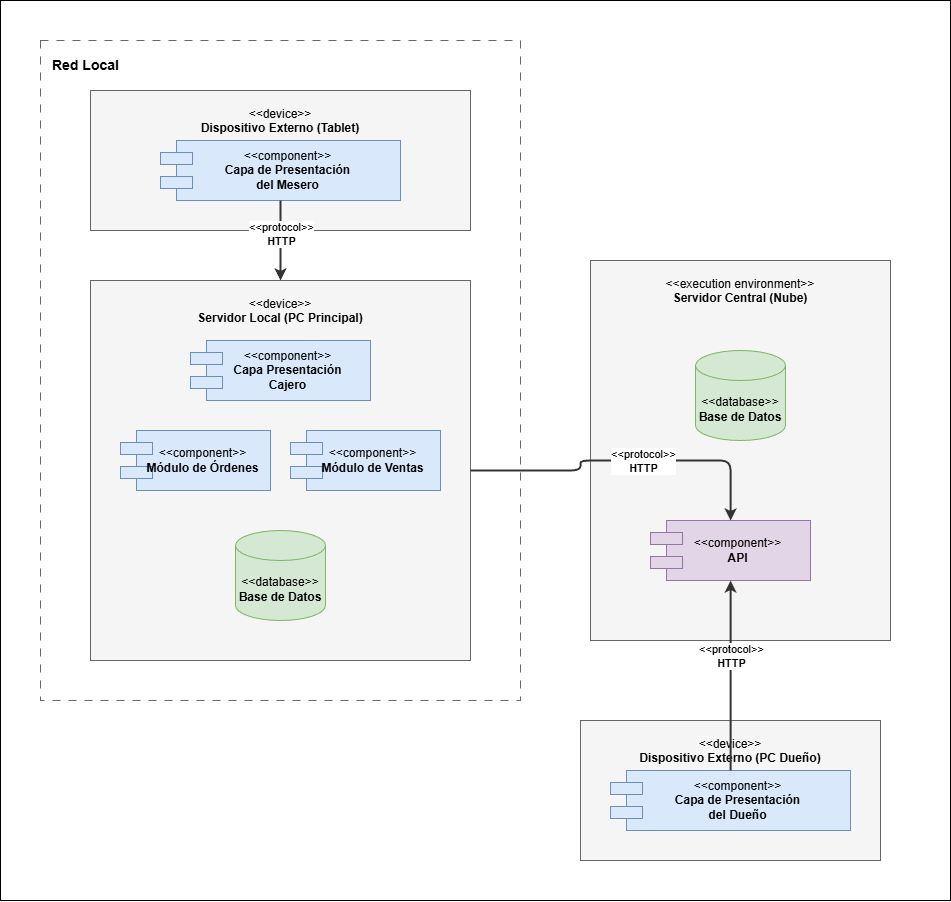

# DISEÑO DE LA ARQUITECTURA CON ADD

# **PASO 1: Revisión de las entradas para el proceso de diseño (inputs).**

## **OBJETIVO DEL NEGOCIO**

El objetivo principal con la creación de este proyecto del negocio de “la Toscana” es llevar un control detallado de los productos vendidos para evitar pérdidas monetarias dado a problemas de control que sus empleados han registrado.

## **OBJETIVO DE LA ITERACIÓN**

Este proyecto se considera greenfield en un dominio de negocio maduro, ya que los problemas que se han identificado en “la Toscana” ya se han atendido con anterioridad en diversos proyectos de software, por lo que se tiene una base para partir con el diseño.

## **HISTORIAS DE USUARIO**

| ID | DESCRIPCIÓN |
| ----- | ----- |
| **HU-01** | Como mesero, quiero registrar las órdenes de los comensales desde una tablet seleccionando productos del catálogo digital, para que las órdenes queden registradas con trazabilidad completa y se eliminen errores u omisiones. |
| HU-02 | Como mesero, quiero que la orden se envíe automáticamente a la pantalla de barra o cocina al confirmar, para que no tenga que llevar comandas en papel y se agilice la comunicación. |
| **HU-04** | Como cajero, quiero consultar las órdenes activas de cada mesa con los totales calculados automáticamente, para que el cobro sea rápido, preciso y sin errores de cálculo manual.  |
| **HU-05** | Como cajero, quiero registrar el método de pago (efectivo o tarjeta) y generar un comprobante de venta, para que cada transacción quede documentada correctamente. |
| **HU-06** | Como cajero, quiero registrar ventas de productos para llevar directamente en el sistema, para que esas ventas no se pierdan ni queden fuera del registro financiero. |
| **HU-10** | Como gerente de sucursal, quiero realizar el corte de caja con ventas totales calculadas automáticamente por el sistema, para que el cierre financiero diario no requiera suma manual y se eliminen las 8 horas semanales dedicadas a esta tarea |
| **HU-15** | Como dueño, quiero consultar un dashboard con indicadores clave de ventas, inventario y finanzas de todas las sucursales, para que pueda tomar decisiones estratégicas basadas en datos confiables y no en reportes verbales. |
| **HU-27** | Como gerente/mesero, quiero que el sistema funcione en modo offline y sincroniza datos automáticamente al restablecerse la conexión, para que las sucursales con internet intermitente no interrumpan su operación. |
| HU-28 | Como dueño, quiero que el sistema aplique roles y permisos diferenciados (dueño, gerente, cajero, mesero, barista, cocinero), para que cada usuario acceda solo a las funcionalidades que le corresponden y la información sensible esté protegida.  |

LAS HISTORIAS DE USUARIO SELECCIONADAS SERÁN: **HU-01, HU-04, HU-05, HU-06, HU-10, HU-28**

## **ATRIBUTOS DE CALIDAD**

PERFORMANCE  
SECURITY

| ID | ATRIBUTO DE CALIDAD | ESCENARIO |
| :---: | :---: | ----- |
| QA-SEC-02  | SECURITY | El sistema impide la modificación de los productos o el total de una orden que ya fue cobrada y cerrada, requiriendo autorización de un gerente para cualquier ajuste post-cierre. *(El candado principal contra el robo hormiga).* |
| QA-SEC-01 | SECURITY | El sistema deniega el acceso al módulo de reportes financieros a usuarios con roles operativos (como meseros), mostrando un mensaje de permisos insuficientes y registrando el intento |
| QA-PERF-02 | PERFORMANCE | El sistema calcula el resumen financiero del día y lo presenta en ≤ 5 segundos tras la solicitud del gerente. |

## **RESTRICCIONES**

| ID | DESCRIPCIÓN |
| ----- | ----- |
| RES-06 | El sistema debe implementar un modelo de roles y permisos diferenciados, restringiendo el acceso a funcionalidades e información según el perfil. |
| RES-09 | El sistema debe operar correctamente sobre la infraestructura existente (5 PCs, 10-14 tablets, 5 TVs, smartphones personales), sin requerir inversión adicional en hardware. |

## **PREOCUPACIONES**

| ID | DESCRIPCIÓN |
| ----- | ----- |
| C003.3.1:  | Trazabilidad completa de operaciones. El sistema debe registrar quién realizó qué acción y cuándo (órdenes, cobros, modificaciones de inventario, cortes de caja). |
| C001.3.1 | (Frecuencia y retención de respaldos): Definir la frecuencia de respaldos y periodos de retención para proteger los datos financieros de las transacciones mensuales de la franquicia. |
| C001.2.1: | Estrategia de sincronización offline-online. ¿Cómo garantizar la consistencia de datos cuando 3 de las 5 sucursales (Amecameca, Yecapixtla, Cuautla) operan con conectividad intermitente y múltiples dispositivos generan datos simultáneamente sin conexión (HU-27)? |

# **PASO 2: Iteración 1 con ADD**

## SELECCIÓN Y DOCUMENTACIÓN DE ARQUITECTURAS DE REFERENCIA

| Nombre del concepto de diseño | Pros | Contras | ¿Elegida? |
| ----- | ----- | ----- | ----- |
| Cliente RICH offline-first \+ API central (PWA/desktop ligero con BD local \+ sincronización) | Los datos son guardados primero en la app en su base de datos local Cumple operación aun sin internet, se reduce la dependencia de conectividad  | La base de datos vive en el dispositivo del navegador, si se borra el cache de la app o navegador, se  pierde la  venta o dato a registrar Sync/conflictos complejos; datos en dispositivo (seguridad); testing más difícil; auditoría requiere reconciliar eventos offline. | NO |
| Arquitectura Cliente-Servidor Locales Simplificados (Monolitos por Sucursal con envío por lotes/baches) | Tiene una velocidad de desarrollo y puesta en escena bastante rápida Funciona totalmente local | El dueño no tiene los registros de ventas en tiempo real, tiene que esperar a que se haga el corte o dado un determinado tiempo se sincronicen los datos | SÍ |
| Estrategia Híbrida: Cliente RICH \+ API Gateway \+ Servicios Esenciales  | Buena opción si se quiere directamente trabajar con la nube para asegurar el registro de ventas Se construyen sólo los microservicios indispensables y mediante el API gateway, se establece comunicación entre locales y microservicios | Saltar entre “online y offline” es brusco, y requiere programar muchas advertencias. Si el equipo de desarrollo no domina colas de mensajes y gateways, consumirá demasiado tiempo capacitarse y desarrollar esta característica | NO |
| Microservicios (servicios por dominio: Órdenes, Cobros, Inventario, Reportes, Catálogo, Auth/Audit) | Permite evolucionar los módulos	escalar independientemente y tener límites claros por dominio.  | El performance se puede ver reducido o el acceso a un módulo se puede interrumpir si el microservicio no está disponible  | NO |

## REGISTRO DE LAS DECISIONES DE INSTANCIACIÓN

| DECISIÓN DE INSTANCIACIÓN | JUSTIFICACIÓN |
| :---: | ----- |
| Servidor local (PC principal) | Ejecutar la operación principal de la sucursal, concentrar lógica local y permitir que la sucursal siga operando aun si la conexión externa falla. |
| Base de datos local  (PC principal) | Persistir órdenes, ventas y datos operativos de la sucursal para consulta y continuidad local. |
| Módulo de órdenes (PC principal) | Registrar órdenes de mesa y probablemente su estado inicial, alineado con HU-01. |
| Módulo de ventas (PC principal) | Calcular/cerrar ventas y apoyar el cobro, alineado con HU-04, HU-05 y HU-06. |
| Capa de presentación del cajero (PC principal) | Interfaz para el cajero en la sucursal: consultar órdenes, cobrar, registrar método de pago y emitir comprobante. |
| Capa de presentación del mesero (tablet) | Interfaz en tablet para capturar órdenes de los comensales y enviarlas al sistema local. |
| API servidor central  (nube) | Punto de integración entre la sucursal y el entorno central; expone servicios HTTP para intercambio de datos. |
| Servidor central (nube) | Centralizar información de múltiples sucursales, coordinar acceso remoto y soportar supervisión global. |
| Capa de presentación del dueño (PC dueño) | Interfaz remota para el dueño; permite consultar información consolidada y, potencialmente, administración global. |

## DIAGRAMA UML DE LA ARQUITECTURA INICIAL

## DOCUMENTACIÓN DE LAS RESPONSABILIDADES DE CADA ELEMENTO DE LA ARQUITECTURA

| Elemento | Responsabilidades |
| ----- | ----- |
| Capa de presentación del mesero (alojada en dispositivo externo) | Suplir de una interfaz de usuario para que el mesero registre órdenes en la mesa, seleccione los productos y envíe la petición a cocina, reduciendo omisiones y eliminando registros manuales (HU-01,HU-02) |
| Capa de presentación del cajero (Alojado en la PC principal, servidor local) | Proveer de interfaz para que el cajero registra formas de pago, administre órdenes para llevar, genera comprobantes y realice corte de caja (HU-04, HU-05, HU-06, HU-10) |
| Módulo de órdenes (servidor local) | Procesa y valida la lógica de negocio detrás de la creación, modificación y enrutamiento de artículos pedidos desde los dispositivos externos de los meseros |
| Modulo de ventas (servidor local) | Permite recuperar las ventas realizadas en el día, impide las ediciones posteriores, provee los datos en crudo para el corte de caja |
| Base de datos local (servidor local) | Almacena las transacciones diarias, el catálogo de la sucursal, los usuarios de la sucursal. |
| Servidor local | Funciona como host de los módulos locales y la base de datos, permite la sincronización de los datos con la nube cuando el internet está disponible (HU-27). |
| Capa de presentación del dueño (alojada en el PC del dueño) | Provee de la interfaz de usuario gráfico para que el dueño pueda ver los datos pertinentes a las ventas por sucursal (HU-15, HU-28, QA-SEC-01). |
| API de comunicación nube (alojada en el PC del dueño) | Expone los endpoints para recibir los datos como el registro de ventas de los diferentes servidores locales de las sucursales, brinda una vía de comunicación directa y segura para el dueño |
| DB central (alojada en un servidor en la nube) | Permite consolidar el histórico y conectar los datos de respaldo a largo plazo, permite al dueño almacenar los datos relacionados a, por ejemplo, las ventas (C001.3.1) |

## EVALUACIÓN DE SATISFACCIÓN DE DRIVERS

| NO SATISFECHO  | PARCIALMENTE SATISFECHO | SATISFECHO |
| :---: | :---: | :---: |
|  | HU-01 | |
|  | HU-04 | |
|  | HU-05 |  |
|  | HU-06 |  |
|  | HU-10 |  |
|  | HU-28 |  |
|  | QA-SEC-02 |  |
|  | QA-SEC-01 |  |
|  | QA-PERF-02 |  |
|  | RES-06 |  |
|  | RES-09 |  |
| C003.3.1 |  |  |
|  | C001.1.3.1 |  |
|  | C001.2.1 |  |
