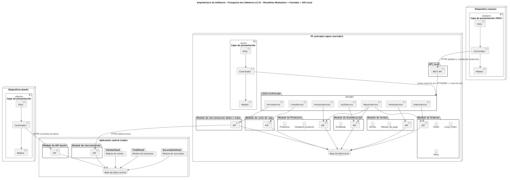
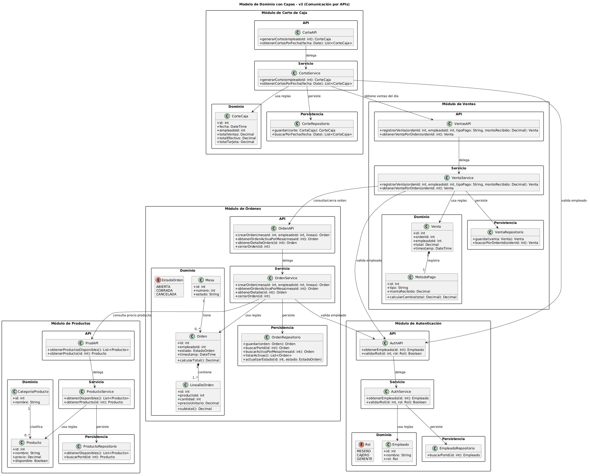
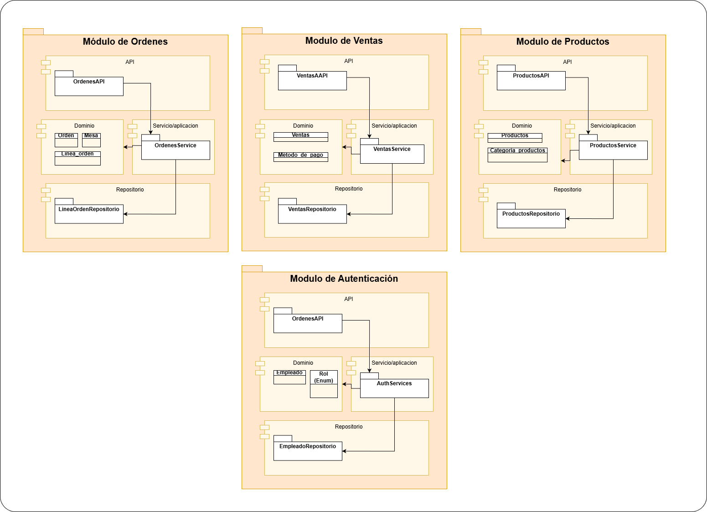
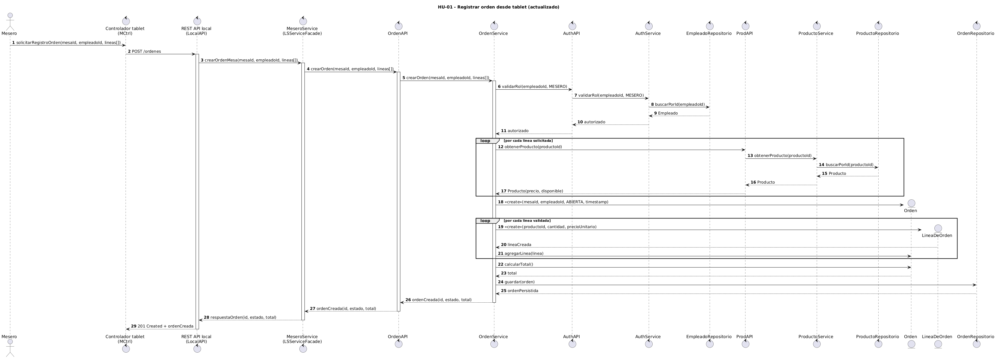
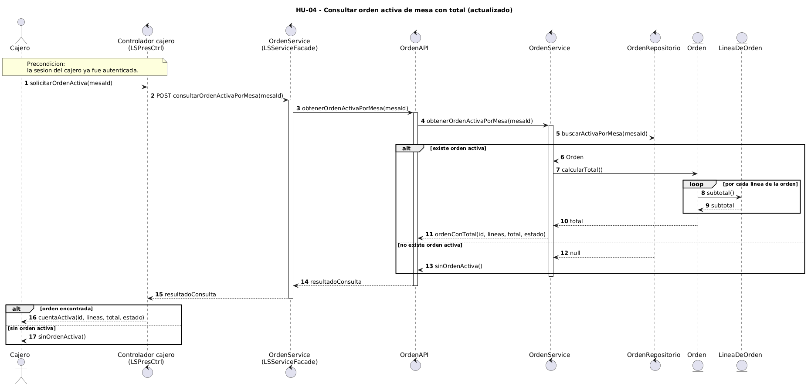
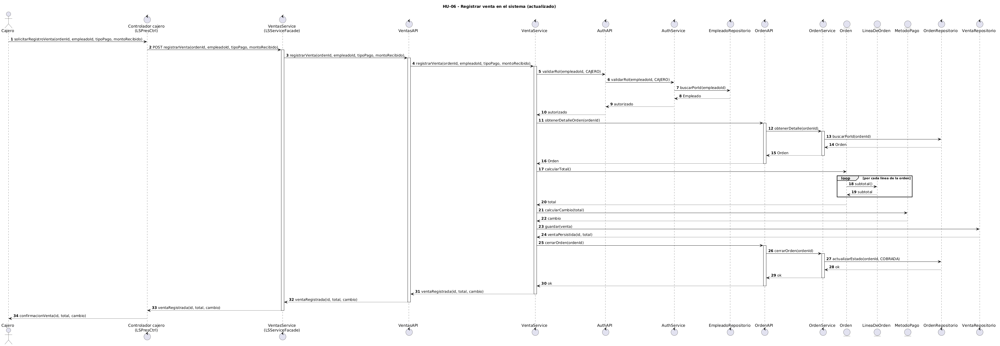

# DISEÑO DE LA ARQUITECTURA CON ADD

Alumno: José Manuel Aguilar De la Cruz

# **PASO 1: Revisión de las entradas para el proceso de diseño (inputs).**

## **OBJETIVO DEL NEGOCIO**

El objetivo principal con la creación de este proyecto del negocio de “la Toscana” es llevar un control detallado de los productos vendidos para evitar pérdidas monetarias dado a problemas de control que sus empleados han registrado.

Este proyecto se considera greenfield en un dominio de negocio maduro, ya que los problemas que se han identificado en “la Toscana” ya se han atendido con anterioridad en diversos proyectos de software, por lo que se tiene una base para partir con el diseño.

## **OBJETIVO DE LA ITERACIÓN**

Elegir y refinar las capas del sistema a partir de la arquitectura anteriormente propuesta. El *foco de refinación para esta iteración será funcional*, esto significa que nos centraremos en la satisfacción de los drivers de historias de usuario, los cuales comunican las funcionalidades primarias que deberá tener el sistema.

## **HISTORIAS DE USUARIO**

Recordando las historias de seleccionadas en la primera iteración, tenemos la siguiente tabla:

| ID | DESCRIPCIÓN |
| ----- | ----- |
| **HU-01** | Como mesero, quiero registrar las órdenes de los comensales desde una tablet seleccionando productos del catálogo digital, para que las órdenes queden registradas con trazabilidad completa y se eliminen errores u omisiones. |
| HU-02 | Como mesero, quiero que la orden se envíe automáticamente a la pantalla de barra o cocina al confirmar, para que no tenga que llevar comandas en papel y se agilice la comunicación. |
| **HU-04** | Como cajero, quiero consultar las órdenes activas de cada mesa con los totales calculados automáticamente, para que el cobro sea rápido, preciso y sin errores de cálculo manual.  |
| **HU-05** | Como cajero, quiero registrar el método de pago (efectivo o tarjeta) y generar un comprobante de venta, para que cada transacción quede documentada correctamente. |
| **HU-06** | Como cajero, quiero registrar ventas de productos para llevar directamente en el sistema, para que esas ventas no se pierdan ni queden fuera del registro financiero. |
| **HU-10** | Como gerente de sucursal, quiero realizar el corte de caja con ventas totales calculadas automáticamente por el sistema, para que el cierre financiero diario no requiera suma manual y se eliminen las 8 horas semanales dedicadas a esta tarea |
| **HU-15** | Como dueño, quiero consultar un dashboard con indicadores clave de ventas, inventario y finanzas de todas las sucursales, para que pueda tomar decisiones estratégicas basadas en datos confiables y no en reportes verbales. |
| **HU-27** | Como gerente/mesero, quiero que el sistema funcione en modo offline y sincronice los datos automáticamente al restablecerse la conexión, para que las sucursales con internet intermitente no interrumpan su operación. |
| HU-28 | Como dueño, quiero que el sistema aplique roles y permisos diferenciados (dueño, gerente, cajero, mesero, barista, cocinero), para que cada usuario acceda solo a las funcionalidades que le corresponden y la información sensible esté protegida.  |

Para esta segunda iteración, se pretende refinar la aplicación local que estará implantada en las cafeterías, así como atacar la comunicación entre esta aplicación local y la aplicación central en la nube, por lo que las historias de usuario seleccionadas para esta iteración son: 

**HU-01, HU-04, HU-06.**

Dejando como historias de usuario secundarias que se atenderán en iteraciones posteriores: 
**HU-05, HU-10, HU-28**

## **ATRIBUTOS DE CALIDAD**

PERFORMANCE  
SECURITY

| ID | ATRIBUTO DE CALIDAD | ESCENARIO |
| :---: | :---: | ----- |
| QA-SEC-02  | SECURITY | El sistema impide la modificación de los productos o el total de una orden que ya fue cobrada y cerrada, requiriendo autorización de un gerente para cualquier ajuste post-cierre. *(El candado principal contra el robo hormiga).* |
| QA-SEC-01 | SECURITY | El sistema deniega el acceso al módulo de reportes financieros a usuarios con roles operativos (como meseros), mostrando un mensaje de permisos insuficientes y registrando el intento |
| QA-PERF-02 | PERFORMANCE | El sistema calcula el resumen financiero del día y lo presenta en ≤ 5 segundos tras la solicitud del gerente. |

Para esta iteración, se seleccionan todo los atributos de calidad: **QA-SEC-02**, **QA-SEC-01** y **QA-PERF-02**

## **RESTRICCIONES**

| ID | DESCRIPCIÓN |
| ----- | ----- |
| RES-06 | El sistema debe implementar un modelo de roles y permisos diferenciados, restringiendo el acceso a funcionalidades e información según el perfil. |
| RES-09 | El sistema debe operar correctamente sobre la infraestructura existente (5 PCs, 10-14 tablets, 5 TVs, smartphones personales), sin requerir inversión adicional en hardware. |

## **PREOCUPACIONES**

| ID | DESCRIPCIÓN |
| ----- | ----- |
| C003.3.1:  | Trazabilidad completa de operaciones. El sistema debe registrar quién realizó qué acción y cuándo (órdenes, cobros, modificaciones de inventario, cortes de caja). |
| C001.3.1 | (Frecuencia y retención de respaldos): Definir la frecuencia de respaldos y periodos de retención para proteger los datos financieros de las transacciones mensuales de la franquicia. |
| C001.2.1: | Estrategia de sincronización offline-online. ¿Cómo garantizar la consistencia de datos cuando 3 de las 5 sucursales (Amecameca, Yecapixtla, Cuautla) operan con conectividad intermitente y múltiples dispositivos generan datos simultáneamente sin conexión (HU-27)? |

Para esta iteración, se tomará en cuenta las preocupaciones que esten relacionadas a la comunicación entre los sistemas locales de cada sucurscal y el sistema central en la nube, adicionalmente, la trazabilidad de las ventas locales:  
**C003.3.1** y **C001.2.1**.

# **PASO 2: Iteración 2 con ADD**

## 2.1 ELEMENTOS A REFINAR

| Concepto arquitectónico | Descripción breve |
| ----- | ----- |
| Modelo de dominio | Se definirán las entidades clave como Ventas, Productos, Órdenes, Empleado, etc., para atacar las historias de usuario de esta iteración. |
| Refinación de servidor local y nube | Se abordará la sincronización y delimitación de módulos en la arquitectura de microservicios o base distribuida. |
| Refinación de capas de los módulos del servidor local | En esta parte se aclara que se establecen estructuralmente las capas de API, Dominio, Servicio/Aplicación y Repositorio. |

## 2.2 REGISTRO DE LAS DECISIONES DE INSTANCIACIÓN

| DECISIÓN DE INSTANCIACIÓN | JUSTIFICACIÓN |
| :---: | ----- |
| Entidad Ventas | Permite atacar las historias de usuario seleccionadas en esta iteración. Permite la gestión de las ventas realizadas durante el día para su registro en la base de datos. Ataca la mayor necesidad del negocio. |
| Entidad Productos | Necesaria para que los meseros puedan armar las órdenes y visualizar la disponibilidad en el catálogo. |
| Entidad Ordenes | Permite reunir la información generada en cada comensal. En conjunto con la entidad Ventas, ataca la mayor necesidad de la empresa. |
| Entidad Empleado | Vital para la seguridad y control de acceso. Mantiene el registro de de quién realiza las operaciones diarias. |
| Entidad Categoria_Producto | Permite proveer de mayores datos para el análisis por parte del dueño. |
| Entidad Método_pago | Registra si el pago fue mediante efectivo o tarjeta, cumpliendo el requerimiento de registro comercial. |
| Entidad Sucursal | Para el servidor central, permite precisar la procedencia de las ventas y otros datos. Excelente para el análisis consolidado por parte del dueño. |
| Módulo Ventas | Subdivisión requerida para encapsular el ciclo de vida asociado a los flujos comerciales locales. |
| Módulo de órdenes | Encargado de centralizar peticiones y estados de preparación desde las tablets a todo el sistema. |
| Módulo de Autenticación | Control de seguridad. Se requiere aislar sus responsabilidades del resto de subsistemas. |
| Módulo de Corte de Caja | Permite gestionar el flujo final de caja basado en los pedidos generados e integrados por los cajeros. |
| Módulo de Productos | Independización del control del catálogo al que accederán localmente las terminales u otros módulos. |
| Capa de presentación (mesero) | Permite dar la puerta gráfica o de cliente pesado mediante tablet al personal involucrado. |
| Arquitectura por Módulos (Capa de módulos por dominio) | Otorga portabilidad y escalabilidad de mantenimiento al dividir la lógica local de la cafetería sin complicar de más su servidor interno. |
| Capa de sincronización con la nube | Coordina activamente las cargas operativas de datos hacia la nube sin obstaculizar la lógica de negocio activa de los módulos locales. |

## 2.3 DIAGRAMAS UML DE LA ARQUITECTURA INICIAL

### 2.3.1 Diagrama de instanciación actualizada

### 2.3.2 Diagrama de modelo de dominio

### 2.3.3 Diagrama de paquetes

### 2.3.4 Diagrama de secuencia (HU-01)

### 2.3.5 Diagramas de secuencia (HU-04, HU-06)

## 2.4 DOCUMENTACIÓN DE LAS RESPONSABILIDADES DE CADA ELEMENTO DE LA ARQUITECTURA

| Elemento | Responsabilidades |
| ----- | ----- |
| Capa API | Funciona como interfaz de red externa, recibiendo la carga enviada por los clientes e invocando servicios. Expone los endpoints REST para las aplicaciones front-end. |
| Capa de Dominio | Concentra toda la lógica del núcleo del negocio, modela los estados, las entidades, y no depende estrictamente de frameworks o bases de datos relacionales, manteniendo la consistencia de las agrupaciones. |
| Capa de Servicio / Aplicación | Orquesta los flujos (use cases). Se encarga de usar el dominio y los repositorios de un módulo para ejecutar acciones complejas (por ejemplo: finalizar el cobro o emitir una comanda). |
| Capa de Repositorio | Persiste los datos manipulados dentro del sistema al gestionar el acceso directo con la base de datos subyacente guardando las transacciones locales. |
| Módulo de Ventas | Controla el registro exhaustivo de lo cobrado, garantizando que el ticket o registro comercial esté adecuadamente salvaguardado y sea auditable (alineado con HU-04, HU-06). |
| Módulo de Órdenes | Coordina la adición de artículos y el ciclo de vida de lo consumido en una mesa viva, sirviendo primordialmente a las tablets que portan los meseros. |
| Módulo de Productos | Abstrae la disponibilidad, precios y catálogo completo evitando que órdenes cobre con un listado erróneo o obsoleto de mercancías. |
| Capa de sincronización | Lógica transversal encargada de vigilar la conectividad local y empujar asincrónicamente o por lotes toda la información recopilada por la sucursal directo hacia el central nube. |

## 2.5 EVALUACIÓN DE SATISFACCIÓN DE DRIVERS

| NO SATISFECHO  | PARCIALMENTE SATISFECHO | SATISFECHO |
| :---: | :---: | :---: |
|  |  | HU-01 |
|  |  | HU-04 |
|  | HU-05 |  |
|  |  | HU-06 |
|  |  | HU-10 |
|  | HU-28 |  |
|  |  | QA-SEC-02 |
|  | QA-SEC-01 |  |
|  |  | QA-PERF-02 |
|  | RES-06 |  |
|  |  | RES-09 |
| C003.3.1 |  |  |
|  |  | C001.1.3.1 |
|  | C001.2.1 |  |